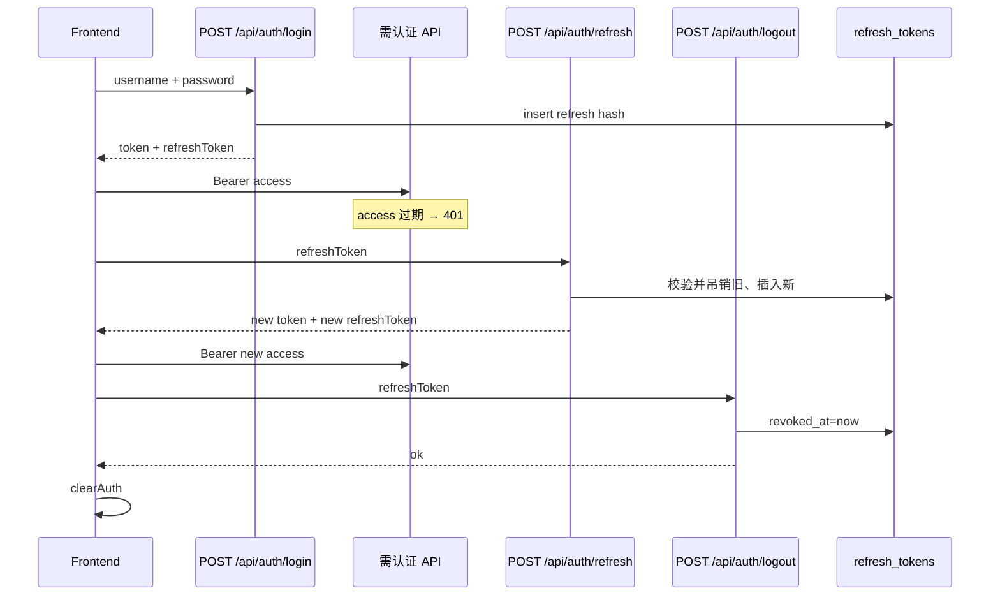

# Plan: 刷新令牌与登出

> 基于：specs/blog-auth-refresh/spec.md v1.2（Implemented）  
> 状态：Implemented  
> 最后更新：2026-07-15

---

## 1. 方案概述

在既有 JWT 登录链路上引入 **Access 短过期 + Refresh 落库可吊销**，实现真登出与改密全端下线，且不引入 Redis：

- 登录 / 注册响应在兼容字段 `token`（= Access）之外增加 `refreshToken`；Access 默认 **30 分钟**，Refresh 默认 **14 天**
- Refresh 为不透明随机串，**仅存 SHA-256 哈希**于 MySQL 表 `refresh_tokens`
- `POST /api/auth/refresh`：校验未过期且未吊销的 Refresh → 签发新 Access，并**轮换** Refresh（旧条吊销）
- `POST /api/auth/logout`：凭 Refresh 吊销当前条（**permitAll**，有 Refresh 即可；幂等）
- `PUT /api/me/password` 成功后 `revokeAllByUserId`
- 前端：持久化 Refresh；401 时尝试静默刷新一次；登出 / 切换账号先调 logout 再 `clearAuth`
- **不做** Access 黑名单；过期 Access 自然 401

不做 OAuth、邮箱验证、设备管理 UI、限流中台。

---

## 2. 架构设计

### 2.1 模块划分

| 模块 | 职责 |
| --- | --- |
| `auth.RefreshToken` | 实体：userId、tokenHash、expiresAt、revokedAt、createdAt |
| `auth.RefreshTokenRepository` | 按 hash 查；按 userId 批量吊销 |
| `auth.RefreshTokenService` | 签发明文 Refresh、落哈希、校验、轮换、单条/全用户吊销 |
| `auth.JwtProperties` | 增补 `accessExpireMinutes`、`refreshExpireDays`；迁移掉「默认 2 小时单票」主策略 |
| `auth.JwtService` | Access 过期改为按**分钟**；claims 保持 `uid` / `role` / subject=username |
| `auth.LoginResponse` | 保留 `token`；新增 `refreshToken`、`accessExpireMinutes`；`expireHours` 可保留为兼容计算值或废弃（见 §2.3） |
| `auth.AuthService` | 登录/注册签发 Access + Refresh |
| `auth.PublicAuthController` | 增补 `POST /refresh`、`POST /logout` |
| `auth.RefreshRequest` / `LogoutRequest` | Body：`refreshToken` |
| `auth.TokenPairResponse`（或复用 LoginResponse 子集） | 刷新成功返回新 `token` + `refreshToken` + 过期字段 |
| `user.PasswordChangeService` | 改密成功后调用 `RefreshTokenService.revokeAllByUserId` |
| `config.SecurityConfig` | `POST /api/auth/refresh`、`/api/auth/logout` → `permitAll` |
| 前端 `utils/auth.js` | 存/取 Refresh；`setAuthSession` / `clearAuth` 扩展 |
| 前端 `api/auth.js` | `refreshSession`、`logout` |
| 前端 `api/http.js` | 401 时单次静默 refresh 后重试；refresh 失败再清会话 |
| 前端 Header / AdminLayout / Profile | 登出先调 API；改密成功文案可提示其它设备需重登 |
| 验收 | `AuthRefreshTests` + `scripts/acceptance-auth-refresh.mjs`；既有测例继续认 `$.data.token` |

### 2.2 数据模型

```text
refresh_tokens
├── id              BIGINT PK AI
├── user_id         BIGINT NOT NULL          -- 逻辑关联 users.id（可不建 FK，与现网风格一致）
├── token_hash      VARCHAR(64) NOT NULL UNIQUE  -- SHA-256 hex
├── expires_at      DATETIME(6) NOT NULL
├── revoked_at      DATETIME(6) NULL         -- 非空即已吊销
└── created_at      DATETIME(6) NOT NULL
```

| 决策 | 说明 |
| --- | --- |
| Schema | `ddl-auto: update` 自动建表 |
| Refresh 形态 | 不透明串：`Base64URL(32 字节安全随机)`；**不是** JWT |
| 存储 | 只存 SHA-256（UTF-8 字节）hex；库中无明文；响应只回一次明文 |
| 为何不用 BCrypt | Refresh 校验需按 hash 精确查找；BCrypt 不适配「先查再比」且更慢 |
| 轮换 | 刷新成功：旧行 `revoked_at=now`，插入新行；旧明文立即失效 |
| 清理 | 本期可不做定时 GC；可选后续删过期行。查询时以 `revoked_at IS NULL AND expires_at > now` 为有效 |
| Access 黑名单表 | **不建** |

### 2.3 接口定义

| 方法 | 路径 | 鉴权 | 说明 |
| --- | --- | --- | --- |
| POST | `/api/auth/login` | 公开 | 既有；响应增 Refresh |
| POST | `/api/auth/register` | 公开 | 既有；同上 |
| POST | `/api/admin/auth/login` | 公开 | 既有；同一 `LoginResponse` |
| POST | `/api/auth/refresh` | 公开 | 用 Refresh 换新 Access + 新 Refresh |
| POST | `/api/auth/logout` | 公开 | 吊销提交的 Refresh；幂等 |
| PUT | `/api/me/password` | 登录 | 既有；成功后吊销该用户全部 Refresh |

**登录 / 注册 / 管理登录成功 `data`（`LoginResponse`）锁定字段**

| 字段 | 类型 | 说明 |
| --- | --- | --- |
| `token` | string | **Access JWT**（兼容既有前端与全部测试 JsonPath） |
| `tokenType` | string | `"Bearer"` |
| `refreshToken` | string | Refresh 明文（仅此响应出现） |
| `accessExpireMinutes` | long | Access 有效分钟数（配置回显） |
| `expireHours` | long | **兼容保留**：`max(1, round(accessExpireMinutes/60.0))` 或固定按配置派生；新前端以 `accessExpireMinutes` 为准 |
| `userId` / `username` / `role` / `displayName` / `avatarUrl` | | 与现网一致 |

```json
{
  "code": 0,
  "message": "ok",
  "data": {
    "token": "eyJ…",
    "tokenType": "Bearer",
    "refreshToken": "…opaque…",
    "accessExpireMinutes": 30,
    "expireHours": 1,
    "userId": 1,
    "username": "alice",
    "role": "AUTHOR",
    "displayName": null,
    "avatarUrl": null
  }
}
```

**POST `/api/auth/refresh` Body**

| 字段 | 类型 | 必填 |
| --- | --- | --- |
| `refreshToken` | string | 是 |

**刷新成功 `data`**：至少含 `token`、`tokenType`、`refreshToken`、`accessExpireMinutes`（及可选用户字段；为减负可不回用户资料，前端保留本地 user）。

锁定：刷新**必须轮换** Refresh；响应中的 `refreshToken` 为新值，旧值立即失效。

**POST `/api/auth/logout` Body**

| 字段 | 类型 | 必填 |
| --- | --- | --- |
| `refreshToken` | string | 是（空则 400） |

成功：`data` 可为 `null`；已吊销 / 找不到 / 已过期 → 仍返回 `code=0`（**幂等**，不泄露是否曾存在）。

**错误约定（锁定）**

| 场景 | HTTP / code | message 示例 |
| --- | --- | --- |
| Refresh 缺失 | 400 | `refreshToken 不能为空` |
| Refresh 无效 / 过期 / 已吊销 | 401 | `登录已失效，请重新登录` |
| Access 过期或无效调需认证接口 | 401 | 既有未认证文案 |
| 其它 | 500 | 既有；响应与日志不回显 Token 原文 |

### 2.4 配置（锁定）

`application.yml` / `JwtProperties`：

```yaml
blog:
  jwt:
    secret: ${JWT_SECRET:…}
    access-expire-minutes: 30   # 替代默认 expire-hours: 2 作为主策略
    refresh-expire-days: 14
    # expire-hours：若保留字段，仅作兼容或测试覆盖；实现以 access-expire-minutes 为准
```

| 项 | 锁定值 |
| --- | --- |
| Access TTL | **30 分钟** |
| Refresh TTL | **14 天** |
| 测试 profile | 可用更短 Access（如 1～2 分钟）便于测过期；或用时钟/过期断言辅助，避免 flaky |

`JwtService.createToken`：`now.plus(accessExpireMinutes, ChronoUnit.MINUTES)`。

### 2.5 业务规则（锁定）

**签发（登录 / 注册）**

1. 校验用户与密码（既有）  
2. `jwtService.createToken(uid, username, role)` → Access  
3. `refreshTokenService.issue(userId)` → 明文 Refresh + 落哈希行  
4. 组装 `LoginResponse`  

**刷新**

1. 对明文做 SHA-256 → 查 `token_hash`  
2. 若不存在 / `revoked_at != null` / `expires_at <= now` → 401  
3. 加载用户；用户不存在 → 401  
4. 吊销当前行；签发新 Access + 新 Refresh（轮换）  
5. 返回新双令牌  

**登出**

1. hash 查找；若有效则设 `revoked_at`  
2. 一律成功响应（幂等）  

**改密**

1. 既有改密逻辑成功写库后  
2. `refreshTokenService.revokeAllByUserId(user.getId())`：将该用户所有 `revoked_at IS NULL` 的行置吊销  
3. **不**强制前端清当前 Access；前端可提示「其它设备需重新登录」；当前页 Access 仍可用至短过期（或前端选择立即 logout——**不强制**，Plan 锁定为：改密成功后**当前页保留会话**，与现 password-change UX 一致，仅服务端踢其它 Refresh）

说明：若希望「改密后本机也重登」，可前端再调 logout；本期 Spec 要求的是全端 Refresh 失效，本机 Access 靠短过期即可。

### 2.6 Security

- `POST /api/auth/refresh`、`POST /api/auth/logout` → `permitAll`（不依赖可能已过期的 Access）  
- 刷新与登出**不**在日志打印 body 中的 Token  
- Access claims 与现网一致，过滤器逻辑基本不动  
- 无设备指纹、无 Cookie；Refresh 存 `localStorage`（与现 Token 同风险模型；后续可再升 HttpOnly Cookie，非本期）

### 2.7 关键流程



### 2.8 前端（锁定）

| 位置 | 变更 |
| --- | --- |
| `utils/auth.js` | `REFRESH_KEY`；`setAuthSession` 增加 `refreshToken`；`getRefreshToken`；`clearAuth` 同时清 Refresh |
| `api/auth.js` | `refreshSession(refreshToken)`、`logout(refreshToken)`；登录/注册调用方写入 Refresh |
| `LoginView` / `RegisterView` | `setAuthSession` 传入 `refreshToken` |
| `api/http.js` | 对 **401**（且非 refresh/login/logout 请求本身）：若有 Refresh，排队单飞刷新一次，用新 Access 重试原请求；刷新失败则 `clearAuth` 并走现有跳转逻辑 |
| `SiteHeader` / `AdminLayout` | `onLogout` / 切换账号：若有 Refresh 则 `await logout(refresh)`（失败忽略）再 `clearAuth` |
| `ProfileView` 改密成功 | 文案可增补「其它设备上的登录将失效」；**不**强制本机 `clearAuth` |

静默刷新注意：并发 401 只触发一次 refresh（Promise 单飞），避免轮换竞态把其它请求的旧 Refresh 打失效。

### 2.9 验收手段

1. **后端测试**：`AuthRefreshTests`（建议）  
   - 登录响应含 `token` + `refreshToken`，无 password/hash  
   - refresh 成功拿到新 token；旧 refresh 再刷失败  
   - logout 后 refresh 失败  
   - 改密后旧 refresh 失败；新密仍可登录拿到新 refresh  
   - 既有 `AuthTests` 等继续通过（依赖 `$.data.token`）  
2. **脚本**：`scripts/acceptance-auth-refresh.mjs`  
   - 登录 → refresh → logout → refresh 失败；可选改密踢会话  
3. **手工**：登出后无法静默续期；挂机超过 Access TTL 仍可续（有 Refresh 时）；改密后另一浏览器标签无法 refresh

---

## 3. 技术选型

| 决策点 | 选型 | 理由 |
| --- | --- | --- |
| Refresh 存储 | MySQL 表 | 无 Redis；可吊销；符合 constitution |
| Refresh 类型 | 不透明随机串 + SHA-256 | 可查可吊销；非 JWT 避免「长寿命不可吊销」 |
| Access 字段名 | 保留 `token` | 零成本兼容全部现有测试与前端 |
| Access TTL | 30 分钟 | Spec 建议 15～30；偏体验一侧 |
| Refresh TTL | 14 天 | Spec 建议 7～14；个人博客够用 |
| 刷新轮换 | **启用** | 降低 Refresh 盗用窗口；配合单飞避免自伤 |
| 登出鉴权 | permitAll + body Refresh | Access 可能已过期仍能真登出 |
| Access 黑名单 | 不做 | 短 Access 足够；降复杂度 |
| 改密本机会话 | 保留当前 Access | 对齐现改密 UX；只吊销 Refresh |

---

## 4. 风险与备选方案

| 风险 | 缓解 |
| --- | --- |
| 前端 401 立刻 `clearAuth` 导致无法静默刷新 | 改 `http.js`：先 refresh 再清；refresh/login 请求排除递归 |
| Refresh 轮换 + 并发请求 | 单飞 Promise；刷新期间其它 401 等待同一结果 |
| 测试大量依赖 `expireHours` / 长会话 | 保留 `token`；更新配置键；测例仍读 `token` |
| 旧前端仅存 Access、无 Refresh | 登出仍 `clearAuth`；无法续期则重新登录（可接受迁移） |
| SHA-256 无盐 | Refresh 熵足够（32 字节）；盐非必须；禁止日志打明文 |
| 改密后本机 Access 仍短时可用 | Spec 已接受；靠 30 分钟窗口 |

**备选（不采用）**

- Refresh 也做成 JWT 且不落库——无法真登出  
- Redis 存 Refresh——须改 constitution  
- Cookie HttpOnly 传 Refresh——改动面大，非本期  

---

## 5. 与 Constitution 的对齐检查

- [x] 不引入 ES / Redis / MQ / OSS SDK / SSR  
- [x] 统一 `{ code, message, data }`；权限与吊销在 Service 层  
- [x] 密码 BCrypt；Refresh 哈希存储；Token 全文不进日志  
- [x] domain 落在既有 `auth`（+ `user` 改密钩子）  
- [x] 关键路径可自动化验收  
- [x] PR / 提交说明引用 `blog-auth-refresh` 与 Task 编号  

---

## 6. 变更记录

| 版本 | 日期 | 变更说明 |
| --- | --- | --- |
| v1.0 | 2026-07-15 | 初稿 Approved；锁定双令牌字段、30min/14d、SHA-256 落库、刷新轮换、permitAll refresh/logout、改密 revokeAll、前端静默刷新与真登出 |
| v1.1 | 2026-07-15 | Implemented；改密 `saveAndFlush` + `@Modifying(flushAutomatically)` 避免吊销清掉未刷盘密码 |
