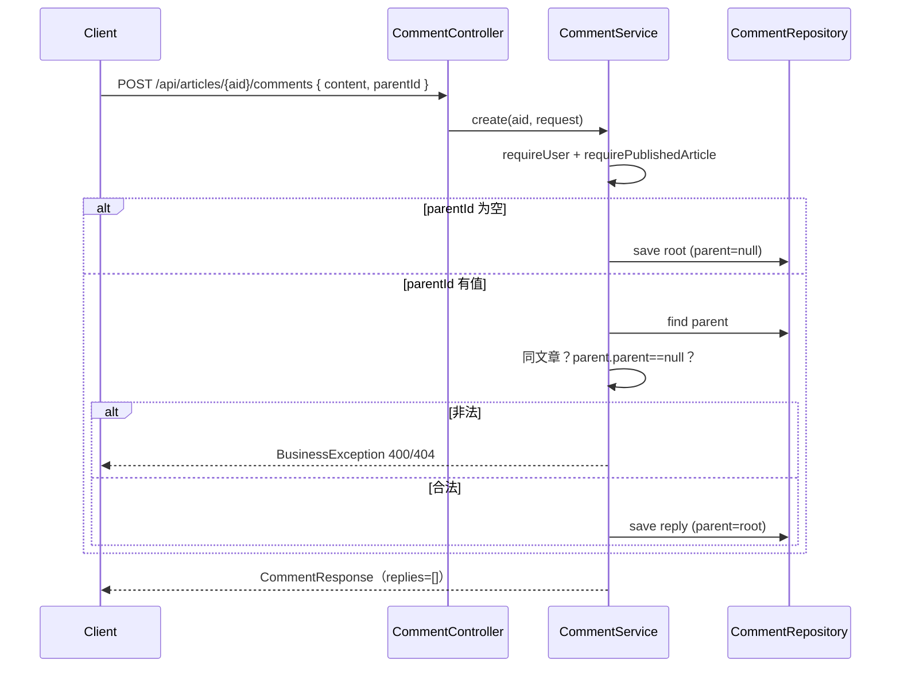
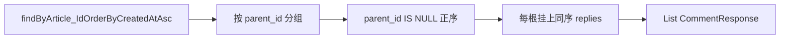

# Plan: 楼中楼评论

> 基于：specs/blog-comment-thread/spec.md v1.2（Implemented）  
> 状态：Implemented  
> 最后更新：2026-07-14

---

## 1. 方案概述

在既有 `comments` / 公开评论 API 上扩展**邻接表楼中楼**：列 `parent_id` 可空；发表接口可选 `parentId`；列表由服务端组装为「根评论 + `replies[]`」。深度硬限制为 **2**（仅允许回复根评论）。删除根评论时在 Service 内级联删子回复并清理相关 `COMMENT` 点赞。访客端详情评论区支持对根评论「回复」与子列表展示。不引入审核状态；不改点赞枚举与 toggle 契约。

---

## 2. 架构设计

### 2.1 模块划分

| 模块 | 职责 |
| --- | --- |
| `comment.Comment` | 增加可空自关联 `parent`（列 `parent_id`）；索引 `idx_comments_parent_id` |
| `comment.CommentRequest` | 可选 `parentId`；`content` 校验不变 |
| `comment.CommentResponse` | 增加 `parentId`、`replies`（列表用；创建接口可返回空 `replies`） |
| `comment.CommentRepository` | 按文章查全量；按 `parent_id` 查子回复（供级联删） |
| `comment.CommentService` | 创建校验（同文、深度）；列表组树；级联删除 + 清赞 |
| `comment.CommentController` | 路径不变；请求/响应形态按下文契约 |
| 访客端 `api/comments.js` | `createComment` 支持可选 `parentId` |
| 访客端 `ArticleDetailView.vue` | 根评论「回复」、嵌套展示、未登录引导 |
| 验收 | `CommentThreadTests`（推荐）+ `scripts/acceptance-comment-thread.mjs` |

无新包、无新 REST 资源路径；不改 `LikeTargetType`。

### 2.2 数据模型

```text
comments
├── id
├── article_id          NOT NULL  (既有)
├── user_id             NOT NULL  (既有)
├── parent_id           NULLABLE  → comments.id（自关联；根评论为 NULL）
├── content             VARCHAR(1000)  (既有)
├── created_at          (既有)
├── INDEX idx_comments_article_id (既有)
└── INDEX idx_comments_parent_id (parent_id)
```

| 决策 | 说明 |
| --- | --- |
| Schema 演进 | 项目使用 `ddl-auto: update`，实体加字段即可；**禁止**要求手工洗数——旧行 `parent_id` 默认为 `NULL` 即根评论（AC-10） |
| 外键 | JPA `@ManyToOne` + `@JoinColumn(name = "parent_id")`；**不**在 DB 上设 `ON DELETE CASCADE`（级联与清赞在 Service 显式完成，避免漏删 likes） |
| 深度 | 仅存一层父子；不引入 `path` / `root_id` 冗余列（深度 2 足够用邻接表） |

实体示意：

```text
Comment
├── Article article
├── User user
├── Comment parent   // nullable
├── String content
└── LocalDateTime createdAt
```

### 2.3 接口定义

路径与鉴权保持 `blog-comment-like`：

| 方法 | 路径 | 鉴权 | 说明 |
| --- | --- | --- | --- |
| GET | `/api/articles/{articleId}/comments` | 公开 | 返回根评论数组，每项含 `replies` |
| POST | `/api/articles/{articleId}/comments` | 登录 | Body 可带 `parentId` |
| DELETE | `/api/comments/{id}` | 登录（作者/ADMIN） | 根则级联；回复则单删 |

**POST Body（`CommentRequest`）**

| 字段 | 类型 | 必填 | 说明 |
| --- | --- | --- | --- |
| `content` | string | 是 | trim 后非空；`@Size(max = 1000)` |
| `parentId` | long \| null | 否 | 省略 / `null` → 根评论；有值 → 回复该根评论 |

**GET / POST 单条字段（`CommentResponse`）**

| 字段 | 说明 |
| --- | --- |
| `id`, `articleId`, `userId`, `username`, `content`, `createdAt` | 既有 |
| `likeCount`, `likedByMe` | 既有；根与回复均计算 |
| `parentId` | 根为 `null`；回复为父根评论 id |
| `replies` | 数组；仅根评论在**列表**中填充；创建接口返回 `replies: []`；回复节点的 `replies` 恒为 `[]` |

**列表响应形状（锁定）**

```json
{
  "code": 0,
  "message": "ok",
  "data": [
    {
      "id": 1,
      "parentId": null,
      "content": "根评论",
      "likeCount": 0,
      "likedByMe": false,
      "replies": [
        {
          "id": 2,
          "parentId": 1,
          "content": "回复",
          "likeCount": 0,
          "likedByMe": false,
          "replies": []
        }
      ]
    }
  ]
}
```

- 根层与各 `replies` 内均按 `createdAt` **正序**
- 扁平旧客户端若仍按数组遍历：根节点仍在顶层；**破坏性**：不再把回复与根混在同一扁平层。本期 Spec 明确改为树；验收以树为准。`acceptance-standard.mjs` 中「列表含某 id」需改为在根或 `replies` 中查找（Task 内回归修补）

**错误约定（`BusinessException`，`code` 非 0，非 5xx）**

| 场景 | 建议 code | message 示例 |
| --- | --- | --- |
| 未登录写 | 401 | 既有 Security / 鉴权 |
| 父评论不存在 | 404 或 400 | 「父评论不存在」 |
| 父评论不属于该文章 | 400 | 「父评论不属于该文章」 |
| 父评论已是回复（深度违规） | 400 | 「仅允许回复一级评论」 |
| 文章非已发布 | 与现网一致（404/业务错误） | 复用 `requirePublishedArticle` |

### 2.4 关键流程

**创建回复**



**列表组树**



实现要点：一次查出该文全部评论（量级与现网一致），内存组树；避免 N+1。点赞计数可对当前用户批量查或沿用逐条 count（与现网一致即可；若易改可抽批量，非必须）。

**级联删除**

```text
delete(commentId):
  鉴权（作者或 ADMIN）
  if comment.parent == null:  // 根
    children = findByParent_Id(commentId)
    for each child: delete likes(COMMENT, child.id); delete child
    delete likes(COMMENT, commentId); delete comment
  else:  // 回复
    delete likes(COMMENT, commentId); delete comment
```

删文章时既有 `ArticleRepository.deleteCommentsByArticleId` 仍删全表评论；若先删 likes 的既有逻辑保持，确认 `parent_id` 不阻碍整文删除（无子行 FK 自引用时：先删子再删父，或 native 删全文章评论——现网 native `DELETE FROM comments WHERE article_id = ?` 在 MySQL 自引用下可能需先置空/先删子。**风险见 §4**：实现时验证整文删除；必要时改为「先删该文全部 comments 的 likes，再按 parent_id IS NOT NULL 删回复、再删根」或临时禁用 FK 检查。推荐在 `ArticleService` 删除文章路径改为显式两步删评论（子→根）或复用 `CommentService.deleteAllByArticle`。

### 2.5 前端（AC-11）

| 位置 | 变更 |
| --- | --- |
| `frontend/src/api/comments.js` | `createComment(articleId, content, parentId?)`；body 仅在有值时带 `parentId` |
| `ArticleDetailView.vue` | 列表按树渲染：根 + 缩进 `replies`；根评论操作区增加「回复」；点击后展开对该根的回复输入框；提交带 `parentId`；成功后刷新列表 |
| 未登录 | 点「回复」提示登录或跳转 `/login`（与一级评论 hint 一致） |
| 点赞 UI | 本期**不强制**补评论点赞按钮（现网详情亦无评论赞 UI）；AC-9 由 API/列表字段 + 验收脚本覆盖 |
| 样式 | 子回复左边距 / 浅分隔，沿用 `--border-soft` 等变量；不做卡片堆砌 |

### 2.6 验收手段

1. **后端测试**（推荐）：`CommentThreadTests`（MockMvc 或 `@SpringBootTest`）  
   - 创建根 + 两条回复 → GET 结构为 1 根且 `replies.length === 2`，正序  
   - 对回复再 `parentId=回复id` → `code === 400`  
   - 跨文章 `parentId` → 400  
   - 删根 → 子与子赞均不存在；删回复 → 根仍在  
   - 无 Token POST → 401  
2. **脚本**：`scripts/acceptance-comment-thread.mjs`（模式对齐 `acceptance-search-enhance.mjs`）  
   - 覆盖 AC-2～AC-9、AC-12 关键路径  
3. **回归**：修补 `acceptance-standard.mjs` 中评论列表断言，使根/回复树结构下仍能找到评论 id（避免标准验收误红）

### 2.7 手工走查清单

1. 登录后发一级评论，再点「回复」发子评，刷新后层级正确  
2. 未登录点回复 → 引导登录，网络无成功写  
3. 删根评论后子回复消失  
4. 旧数据（仅一级）仍显示在根层  
5. 尝试用 API 对回复再回复 → 业务错误  

---

## 3. 技术选型

| 决策点 | 选型 | 理由 |
| --- | --- | --- |
| 存储模型 | 邻接表 `parent_id` | Spec 建议；深度 2 足够；迁移简单 |
| 列表形态 | 服务端组「父 + `replies`」 | Spec AC-4；前端不猜层级 |
| 深度策略 | 拒绝回复之回复（400） | 比「自动挂到根」更可测、语义清晰 |
| 删除 | Service 级联硬删 + 清赞 | Spec AC-6；不做软删占位 |
| Schema | `ddl-auto: update` | 与项目现状一致；无 Flyway |
| 验收 | 单测 + 独立 acceptance 脚本 | 与 search/rss 增量一致 |

备选（不采用）：路径枚举 / `root_id` 冗余、无限嵌套、删除占位「已删除」。

---

## 4. 风险与备选方案

| 风险 | 影响 | 缓解 |
| --- | --- | --- |
| 自引用 FK + `DELETE WHERE article_id` | 整文删除失败或顺序错误 | Task 含回归：删带楼中楼的文章；必要时 `CommentService.deleteAllByArticle` 先子后根 |
| 列表改为树破坏旧扁平假设 | `acceptance-standard` / 其它脚本误失败 | Task 同步改断言为树查找 |
| 评论量大时一次全量加载 | 性能 | Non-Goals 已排除分页；个人博客量级可接受 |
| 前端误把回复按钮挂到子评 | 违反深度 2 UX | UI 仅根评论显示「回复」；即使用 API 违规也由后端拒绝 |
| N+1 点赞计数 | 列表变慢 | 先与现网一致；过慢再批量 count（微小优化，不改 Spec） |

---

## 5. 与 Constitution 的对齐检查

- [x] 不引入 Elasticsearch / Redis / 消息队列 / OSS / SSR
- [x] 查询用 JPA Repository / 参数化，无 SQL 拼接（整文删评论若保留 native，须仍参数化且只删本 article）
- [x] 写权限与删除授权在 Service 层
- [x] 关键路径具备自动化验收（测试 + 脚本）
- [x] 域名仍在既有 `comment` / `like` 包，无新中间件

---

## 6. 变更记录

| 版本 | 日期 | 变更说明 |
| --- | --- | --- |
| v1.0 | 2026-07-14 | 初稿 Approved；锁定邻接表、树形列表、深度拒绝、级联删、验收脚本 |
| v1.1 | 2026-07-14 | Implemented；删文评论先子后根；`CommentThreadTests` 通过 |
