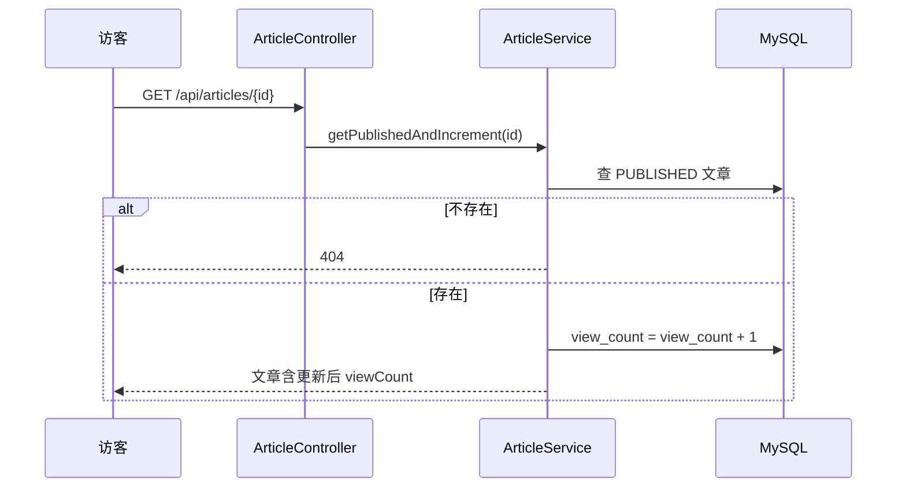

# Plan: 文章内容增强（标准版）

> 基于：specs/blog-content-enhance/spec.md v1.0  
> 状态：Approved  
> 最后更新：2026-07-14

---

## 1. 方案概述

在现有 `articles` 表与文章 API 上增量扩展字段与查询条件：引入显式 `status` 枚举；公开接口仅返回 `PUBLISHED` 且 `publishedAt <= now`；管理端 CRUD 支持新字段；前端详情用 Markdown 渲染库 + DOM sanitizer；阅读量在公开详情接口内递增。

---

## 2. 架构设计

### 2.1 数据模型变更（articles）

| 字段 | 类型 | 说明 |
| --- | --- | --- |
| status | VARCHAR(20) NOT NULL | `DRAFT` / `PUBLISHED` / `OFFLINE`，默认 `DRAFT` |
| cover_url | VARCHAR(512) NULL | 封面图 URL |
| summary | VARCHAR(500) NULL | 摘要 |
| view_count | BIGINT NOT NULL DEFAULT 0 | 阅读量 |
| pinned | BOOLEAN NOT NULL DEFAULT FALSE | 置顶 |
| recommended | BOOLEAN NOT NULL DEFAULT FALSE | 推荐（供站点体验模块首页使用） |

既有字段保留。历史数据迁移：启动时或 DDL 默认将已有行视为 `PUBLISHED`（`ddl-auto` update + 应用层默认）。

### 2.2 接口变更

| 方法 | 路径 | 变更 |
| --- | --- | --- |
| GET | `/api/articles` | 过滤 status=PUBLISHED；排序 pinned DESC, publishedAt DESC；响应含 summary/coverUrl/viewCount/pinned/recommended |
| GET | `/api/articles/{id}` | 同上过滤；成功则 viewCount+1；content 为原始 Markdown |
| GET/POST/PUT | `/api/admin/articles*` | Request/Response 含新字段；可按 status 筛选（可选） |

公开「已发布」定义：`status = PUBLISHED AND publishedAt <= now`。

### 2.3 前端

- 管理端文章表单：状态选择、封面 URL、摘要、置顶/推荐开关；正文提示 Markdown
- 访客详情：`marked` + `DOMPurify`（或等价）渲染；展示封面、阅读量
- 列表卡片：展示封面缩略（若有）、summary、阅读量、置顶标识

### 2.4 关键流程（阅读量）

---

## 3. 技术选型

| 决策点 | 选型 | 理由 |
| --- | --- | --- |
| 状态 | Java enum + JPA STRING | 清晰三态 |
| MD 渲染 | 前端 marked + DOMPurify | 后端仍存 MD；消毒在展示层 |
| 阅读量 | JPA `@Modifying` 增量更新 | 简单可靠，标准版够用 |
| 列表摘要 | summary 优先，空则截断 content 120 字 | 满足 AC-7 |

---

## 4. 风险与备选

| 风险 | 缓解 |
| --- | --- |
| 旧数据无 status | 默认 PUBLISHED + 列默认值 |
| 并发阅读量不准 | 标准版可接受；进阶 Redis |
| XSS | DOMPurify 严格白名单 |

---

## 5. 与 Constitution 对齐

- [x] 不引入 OSS/Redis
- [x] 统一响应与 domain 分包
- [x] XSS 消毒
- [x] Service 层强制公开可见性

---

## 6. 变更记录

| 版本 | 日期 | 变更说明 |
| --- | --- | --- |
| v1.0 | 2026-07-14 | 初稿 Approved |
