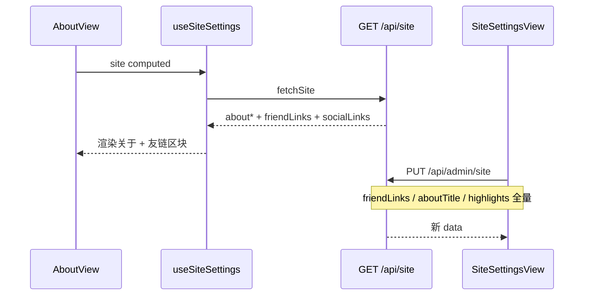

# Plan: 友链与关于页可配

> 基于：specs/blog-friend-links/spec.md v1.2（Implemented）  
> 状态：Implemented  
> 最后更新：2026-07-15

---

## 1. 方案概述

在既有站点配置单例与关于页上交付两件事，**不引入** Redis / OSS / SSR / 独立友链申请流：

1. **友链（blogroll）**：`site_settings` 增补 JSON 列 `friend_links`；经既有 `GET /api/site` / `PUT /api/admin/site` 读写；与 `social_links` 分列；管理端站点设置内维护；访客在关于页展示
2. **关于页结构化文案**：同单例增补 `about_title`、`about_display_name`、`about_highlights`（JSON）；复用既有 `about_text`；前台 `/about` 读取公开配置，缺省回落 `site.js`

不做独立友链表、独立 CRUD 路径、启用开关（删除即下线）、独立「友链」路由、申请审核。

---

## 2. 架构设计

### 2.1 模块划分

| 模块 | 职责 |
| --- | --- |
| `site.SiteSettings` | 增补列：`friend_links`、`about_title`、`about_display_name`、`about_highlights` |
| `site.SiteSettingsRequest` / `Response` | 读写新字段；内嵌 `FriendLink` DTO |
| `site.SiteService` | 校验友链条数/字段/URL；规范化 `sortOrder`；校验关于字段长度与亮点规模；映射响应 |
| `site.SiteController` | 路径不变；响应自动含新字段 |
| `config.SecurityConfig` | **无需改**：既有 `/api/site` 公开、`/api/admin/site` ADMIN |
| 前端 `useSiteSettings.js` | 映射 `friendLinks` / `aboutTitle` / `aboutDisplayName` / `aboutHighlights` |
| 前端 `AboutView.vue` | 渲染可配标题/展示名/简介/亮点 + 友链区块 |
| 前端 `admin/SiteSettingsView.vue` | 「关于页」结构化表单项 + 「友情链接」列表编辑（含上下移排序） |
| 前端 `api/site.js` | 无新路径；`updateSite` body 带新字段 |
| 验收 | `FriendLinksSiteTests` + `scripts/acceptance-friend-links.mjs` |

不新建 domain 包；全部落在既有 `site`。

### 2.2 数据模型

`site_settings` 单例扩展（`ddl-auto: update`）：

| 列 | 类型 | 默认 | 说明 |
| --- | --- | --- | --- |
| `friend_links` | `TEXT NOT NULL` | `'[]'` | JSON 数组；与 `social_links` **分列** |
| `about_title` | `VARCHAR(100) NULL` | `NULL` | 空/null → 前台默认「关于我」 |
| `about_display_name` | `VARCHAR(50) NULL` | `NULL` | 关于页展示名；空/null → 前台 `siteConfig.author` |
| `about_highlights` | `TEXT NOT NULL` | `'[]'` | JSON 字符串数组 |

既有 `about_text` / `social_links` / 主题视觉字段不变。

**友链 JSON 元素（锁定）**

```json
{
  "name": "友站名",
  "url": "https://example.com",
  "description": "一句话简介，可空",
  "sortOrder": 0
}
```

| 字段 | 约束 |
| --- | --- |
| `name` | 必填；trim 后非空；最大 **50** |
| `url` | 必填；最大 **512**；仅 `http://` / `https://`（**不允许**站内相对路径；拒绝 `javascript:` / `data:` / `vbscript:`） |
| `description` | 可空；最大 **200**；缺省存 `""` |
| `sortOrder` | 非负整数；公开返回按此升序；同分再按 `name` 字典序（稳定） |

**规模上限（锁定）**

| 项 | 上限 |
| --- | --- |
| 友链条数 | **50** |
| 亮点条数 | **10** |
| 单条亮点长度 | **100** |
| `aboutTitle` | **100** |
| `aboutDisplayName` | **50** |
| `aboutText` | 既有行为；Service 层补硬上限 **5000**（超长 400） |

**启用开关**：本期**不做**；列表中删除即对访客不可见。

### 2.3 接口定义

路径不变：

| 方法 | 路径 | 鉴权 |
| --- | --- | --- |
| GET | `/api/site` | 公开 |
| PUT | `/api/admin/site` | ADMIN（既有） |

**公开 / 管理响应 `data` 增补字段（锁定名）**

| 字段 | 类型 | 说明 |
| --- | --- | --- |
| `friendLinks` | `FriendLink[]` | 已按 `sortOrder` ASC、`name` ASC 排序 |
| `aboutTitle` | string \| null | |
| `aboutDisplayName` | string \| null | |
| `aboutHighlights` | `string[]` | 空数组表示无亮点 |
| `aboutText` | string | 既有 |
| `socialLinks` | 既有 | **不得**被 `friendLinks` 覆盖 |

**PUT Body 增补**

| 字段 | 未传（`null`）策略 | 说明 |
| --- | --- | --- |
| `friendLinks` | **保持库中原值** | 管理端表单始终提交全量数组（含 `[]` 清空） |
| `aboutTitle` | 保持原值 | 传 `""` 则存空串（前台走默认标题） |
| `aboutDisplayName` | 保持原值 | 传 `""` 清空展示名覆盖 |
| `aboutHighlights` | 保持原值 | 传 `[]` 清空亮点 |
| 既有字段 | 既有语义 | `aboutText` / `socialLinks` 等行为不变 |

管理端本期保存时**始终提交**上述新字段全量，避免误保持脏数据。

**校验（Service 锁定）**

| 规则 | 行为 |
| --- | --- |
| `friendLinks.size() > 50` | 400「友链最多 50 条」 |
| 任一条 `name` 空白 / 超长 | 400 |
| 任一条 `url` 非法 scheme 或超长 | 400 |
| `description` 超长 | 400 |
| `aboutHighlights.size() > 10` | 400 |
| 亮点项空白（trim 后空） | 400 或过滤掉空白项（锁定：**过滤** trim 后空串，再校验条数） |
| `aboutText` 长度 > 5000 | 400 |
| 保存前 | 将 `friendLinks` 按提交顺序重写 `sortOrder = 0..n-1`（管理端上下移即改数组顺序；服务端以数组序为准归一化，忽略客户端乱序 sortOrder） |

公开 GET：返回归一化后的列表（已排序）；空为 `[]`，不 5xx。

### 2.4 前台展示（锁定）

**主入口**：仅 **关于页** `/about` 内增「友情链接」区块；**不**新增顶栏「友链」路由。

`AboutView` 数据源：

| UI | 来源 | 降级 |
| --- | --- | --- |
| 标题 `<h1>` | `aboutTitle` | `'关于我'` |
| 展示名 | `aboutDisplayName` | `siteConfig.author` |
| 简介 | `aboutText` | `siteConfig.about.intro`；若最终仍为空则**不渲染** `.intro` |
| 亮点 | `aboutHighlights` | 空则**不渲染** `.highlights`；非空不再读 `siteConfig.about.highlights`（有远程配置优先；仅当公开接口无该字段/请求失败时回落 `site.js`） |
| 社交 | 既有 `socialLinks` | 既有 |
| 友链 | `friendLinks` | 空则**整块隐藏**（不显示空态文案） |
| 头像 | 既有 `aboutAvatarUrl` + `AboutAvatar` | 不改 |

友链项 UI：名称（链接）+ 可选简介一行；`target="_blank"` + `rel="noopener noreferrer"`；`href` 仅使用已通过后端校验的 http(s) URL（前端再拒非 http(s) 作兜底，不渲染危险项）。

区块标题文案固定：**「友情链接」**（不做后台可配）。

### 2.5 管理端表单（锁定）

`SiteSettingsView`：

1. 将「关于文案」升级为分区「关于页」：
   - 关于标题 `aboutTitle`
   - 展示名 `aboutDisplayName`
   - 关于文案 `aboutText`（既有）
   - 亮点列表：多行输入或动态行（+ 添加 / 删除），提交为 `string[]`
2. 在社交链接之后（或独立 divider）增加「友情链接」：
   - 每行：名称、URL、简介、上移/下移、删除
   - 「+ 添加友链」；保存时按当前数组顺序提交
3. 保存仍走 `updateSite`；成功 `ElMessage`

副文案：站点设置页说明补上「友情链接与社交链接相互独立」。

### 2.6 前端数据流



### 2.7 验收手段

1. **后端**：`FriendLinksSiteTests`
   - GET 含 `friendLinks` / `aboutTitle` / `aboutDisplayName` / `aboutHighlights` 默认值
   - ADMIN PUT 写入友链后公开顺序正确；`socialLinks` 不被覆盖
   - 超条数 / 非法 URL / 超长 → 400
   - 未登录 PUT → 401；非 ADMIN → 403
   - 空 `friendLinks=[]` 公开仍 200
   - 关于字段更新后公开可读
2. **脚本**：`scripts/acceptance-friend-links.mjs`
   - 公开字段存在；ADMIN 写入 2 条友链（调换顺序）后公开顺序一致；改关于标题后公开可读；再清空友链
3. **前端手工**：`/about` 有友链可点外链；无友链时区块消失；管理端可排序保存
4. **构建**：前端 `npm run build` 通过

---

## 3. 技术选型

| 决策点 | 选型 | 理由 |
| --- | --- | --- |
| 友链存储 | 站点单例 JSON 列 | 与 `social_links` 一致；≤50 条无需独立表/CRUD |
| 读写路径 | 扩展既有 `/api/site` | 少接口面；权限模型已验证 |
| 启用开关 | 不做 | 删除即下线，够用 |
| 前台入口 | 仅关于页区块 | 个人站信息集中；不增导航噪音 |
| 展示名 | 纳入 `aboutDisplayName` | 去掉关于页对 `site.js` author 的硬依赖 |
| 友链区标题 | 前端固定文案 | 非必要可配，减字段 |
| 排序 | 数组顺序 → 服务端写 `sortOrder` | 管理端上下移直观 |

---

## 4. 风险与备选方案

| 风险 | 缓解 |
| --- | --- |
| 与 `socialLinks` 混淆 | 分列、分表单项、验收断言互不覆盖 |
| 旧 PUT 客户端不传新字段 | `null` 保持原值；新管理端全量提交 |
| 外链 XSS / 危险 scheme | 后端仅 http(s)；前端 `rel` + scheme 兜底；禁止 `v-html` 渲染名称/简介 |
| JSON 列损坏 | parse 失败回落 `[]`，与 social 一致 |
| `aboutText` 同时作家页副文案 | 保持既有 `heroSubtitle` 映射，不改首页语义 |

**备选（不采用）**：独立 `friend_link` 表 + REST CRUD；独立 `/friends` 路由；友链 logo 上传。

---

## 5. 与 Constitution 的对齐检查

- [x] 不引入 ES / Redis / MQ / OSS SDK / SSR  
- [x] 统一 JSON 响应；domain 仍为 `site`；权限走既有 ADMIN + Service 校验  
- [x] URL / 长度 / 条数在 Service 层强制  
- [x] 关键路径可自动化验收；PR 引用 `blog-friend-links` 与 Task 编号  

---

## 6. 变更记录

| 版本 | 日期 | 变更说明 |
| --- | --- | --- |
| v1.0 | 2026-07-15 | Approved；锁定单例 JSON 友链、关于三字段、接口复用、关于页挂载、无启用开关/无独立路由 |
| v1.1 | 2026-07-15 | Implemented；前后端与验收齐套 |
