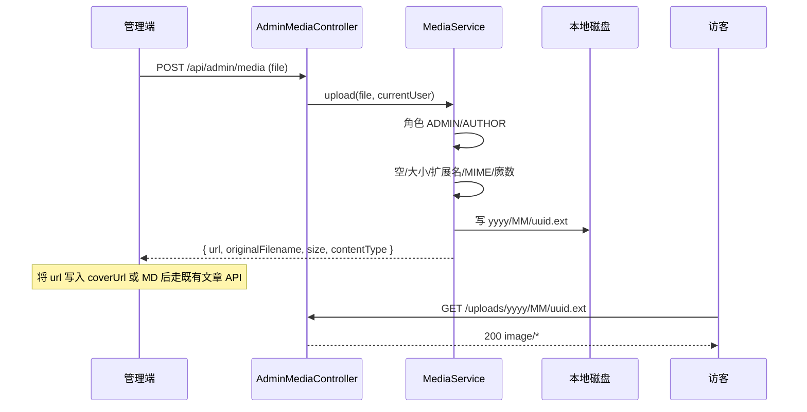

# Plan: 媒体上传

> 基于：specs/blog-media-upload/spec.md v1.2（Implemented）  
> 状态：Implemented  
> 最后更新：2026-07-14

---

## 1. 方案概述

新增 **本地磁盘图片上传**：`ADMIN` / `AUTHOR` 通过 multipart 接口上传白名单图片，服务端写入约定目录并返回公开相对 URL；访客与前端可用该 URL 作为 `coverUrl` 或 Markdown 插图。不引入对象存储 SDK、媒体元数据表、孤儿清理或 CDN。

锁定要点：

- 上传：`POST /api/admin/media`（`multipart/form-data`，字段名 `file`）
- 公开读：`GET /uploads/**` → 映射本地存储根（原始字节，非 JSON）
- 落盘名：`{uuid}{ext}`（可选分子目录 `yyyy/MM/`）；**忽略**客户端原始路径
- 默认单文件 **8 MiB**；MIME + 扩展名双白名单；建议校验魔数
- 管理端文章编辑：封面上传 + 正文「插入图片」

---

## 2. 架构设计

### 2.1 模块划分

| 模块 | 职责 |
| --- | --- |
| `config.UploadProperties` | 绑定 `blog.upload.*`（dir、max-size-bytes、public-path-prefix） |
| `media.MediaService` | 校验类型/大小/空文件；生成安全名；落盘；组装返回 `url` |
| `media.MediaUploadResponse` | `url`、`originalFilename`、`size`、`contentType` |
| `media.AdminMediaController` | `POST /api/admin/media` |
| `config.WebMvcConfig`（或等价） | `ResourceHandler`：`/uploads/**` → `file:{uploadDir}/` |
| `config.SecurityConfig` | `/api/admin/media/**` → `ADMIN`/`AUTHOR`；`GET /uploads/**` → `permitAll` |
| `common.GlobalExceptionHandler` | `MaxUploadSizeExceededException` / 相关 multipart 异常 → `code=400` |
| 管理端 `api/adminMedia.js` | FormData 上传 |
| 管理端 `ArticlesView.vue` | 封面上传、正文插入 MD 图片 |
| Vite proxy | `/uploads` → `8080` |
| 验收 | `MediaUploadTests` + `scripts/acceptance-media-upload.mjs` |

新增 domain 包 `media`（与既有 `feed` 同级）；**不**改文章表；**不**新建媒体库表。

### 2.2 数据模型与配置

无 schema 变更。配置（`application.yml`）：

```yaml
spring:
  servlet:
    multipart:
      max-file-size: 8MB
      max-request-size: 8MB

blog:
  upload:
    # 本地存储根（相对进程工作目录或绝对路径）；环境变量可覆盖
    dir: ${BLOG_UPLOAD_DIR:./data/uploads}
    # 单文件上限（字节）；与 spring.servlet.multipart 保持一致语义
    max-size-bytes: ${BLOG_UPLOAD_MAX_SIZE:8388608}
    # 对外 URL 路径前缀（无尾斜杠）
    public-path-prefix: /uploads
```

| 配置 | 默认 | 说明 |
| --- | --- | --- |
| `blog.upload.dir` | `./data/uploads` | 存储根；启动时可 `Files.createDirectories`；日志只记相对 key，不打完整敏感绝对路径 |
| `blog.upload.max-size-bytes` | `8388608`（8 MiB） | Service 层二次校验；≤0 时回退 8 MiB |
| `blog.upload.public-path-prefix` | `/uploads` | 返回 URL = `{prefix}/{相对路径}`，如 `/uploads/2026/07/{uuid}.png` |
| `spring.servlet.multipart.max-*-size` | `8MB` | 容器层拦截超大请求，避免占满内存 |

**gitignore**：将 `backend/data/uploads/`（或仓库根 `data/uploads/`）加入忽略，避免把用户文件提交进 Git（Task 内落实路径与忽略条目一致）。

**不**把上传目录配进 classpath `static/`（避免打进 jar 后不可写）。

### 2.3 接口定义

| 方法 | 路径 | 鉴权 | 说明 |
| --- | --- | --- | --- |
| POST | `/api/admin/media` | ADMIN / AUTHOR（JWT） | multipart 上传；成功返回 JSON `Result` |
| GET | `/uploads/**` | 公开 | 静态资源；不存在 → 404（框架默认） |

**POST 请求**

- `Content-Type`：`multipart/form-data`
- 表单字段：`file`（必填，单文件）
- 无其它业务字段；**不**接收客户端指定存储路径

**成功响应 `data`（`MediaUploadResponse`）**

| 字段 | 类型 | 说明 |
| --- | --- | --- |
| `url` | string | **相对路径**，如 `/uploads/2026/07/a1b2….png`；可直接写入 `coverUrl` / MD |
| `originalFilename` | string \| null | 客户端原始文件名（仅展示；已消毒截断，最长 200） |
| `size` | long | 字节数 |
| `contentType` | string | 归一化后的 MIME（如 `image/png`） |

```json
{
  "code": 0,
  "message": "ok",
  "data": {
    "url": "/uploads/2026/07/550e8400-e29b-41d4-a716-446655440000.png",
    "originalFilename": "cover.png",
    "size": 12345,
    "contentType": "image/png"
  }
}
```

**错误约定（业务失败走 `Result`，非 5xx）**

| 场景 | code | message 示例 |
| --- | --- | --- |
| 未登录 | 401 | 既有 Security 入口 |
| 非 ADMIN/AUTHOR | 403 | 既有 AccessDenied |
| 缺少 `file` / 空文件 | 400 | 「请选择图片文件」/「文件不能为空」 |
| 类型不在白名单 | 400 | 「不支持的图片类型」 |
| 超过大小上限 | 400 | 「文件大小不能超过 8MB」 |
| 非 multipart / 解析失败 | 400 | 「请求格式错误」 |
| 磁盘写入失败 | 500 | 「服务器内部错误」（日志记相对 key；不向客户端暴露绝对路径） |

**GET `/uploads/...`**：成功返回图片字节 + 对应 `Content-Type`；**不**包 `{ code, message, data }`。

### 2.4 类型与安全校验（锁定）

**白名单**

| 扩展名（小写） | 允许 Content-Type | 魔数（建议） |
| --- | --- | --- |
| `.jpg` / `.jpeg` | `image/jpeg`（兼容声明 `image/jpg`） | `FF D8 FF` |
| `.png` | `image/png` | `89 50 4E 47` |
| `.gif` | `image/gif` | `GIF87a` / `GIF89a` |
| `.webp` | `image/webp` | `RIFF....WEBP` |

校验顺序（Service）：

1. `file == null` 或 `isEmpty` → 400  
2. `size > max-size-bytes` → 400（即便容器已拦，仍保留）  
3. 从**原始文件名**解析扩展名（只取最后一段）；无扩展名或不在表 → 400；**丢弃**路径段（`../`、`\`、`/` 一律不参与落盘路径）  
4. `getContentType()` 归一化后须与扩展名对应 MIME 匹配 → 否则 400  
5. 读取文件头做魔数校验（与扩展名一致）→ 否则 400（防止「改扩展名的 exe」）  
6. 生成 `UUID` + 映射扩展名（`.jpeg` 统一存 `.jpg` 亦可，Plan 锁定：**统一 `.jpg` / `.png` / `.gif` / `.webp`**）  
7. 相对路径：`yyyy/MM/{uuid}{ext}`（`Asia/Shanghai` 年月）；解析目标 `Path` 后须 `normalize` 且 `startsWith(storageRoot)`，否则拒绝  
8. 落盘；返回 `url = public-path-prefix + "/" + 相对路径（正斜杠）`

**禁止**：用客户端文件名作为落盘名；禁止符号链接跟随到根外（若检测困难，至少保证 normalize + startsWith）。

### 2.5 关键流程



上传**不**调用 `ArticleService`；文章保存仍走既有 `POST/PUT /api/admin/articles`。

### 2.6 Security 与开发代理

`SecurityConfig` 在 `/api/admin/articles/**` 规则旁增加：

```text
.requestMatchers("/api/admin/media/**").hasAnyRole("ADMIN", "AUTHOR")
.requestMatchers(HttpMethod.GET, "/uploads/**").permitAll()
```

（`/api/admin/**` 默认仅 ADMIN 的规则须排在 media 规则**之后**，与 articles 同样写法。）

`frontend/vite.config.js` 增加：

```js
'/uploads': {
  target: 'http://localhost:8080',
  changeOrigin: true,
},
```

生产：网关将 `/uploads` 与 `/api` 一并反代到后端（运维约定；本期不强制 Docker）。

访客端 ``：相对路径 `/uploads/...` 在开发态经 Vite 代理；生产同源即可。

### 2.7 前端（AC-10）

| 位置 | 变更 |
| --- | --- |
| `frontend/src/api/adminMedia.js` | `uploadMedia(file)`：`FormData` + `file` 字段；**不要**手动设 `Content-Type`（交给浏览器带 boundary）；走现有 `http` 实例带 Token |
| `ArticlesView.vue` 封面 | 保留可手填 URL；旁加 `el-upload`（或按钮选文件）：成功后 `form.coverUrl = data.url`；可预览 |
| `ArticlesView.vue` 正文 | 「插入图片」：上传成功后在光标处或文末插入 `\n\n` |
| 文案 | 提示支持 jpg/png/gif/webp，最大 8MB |

AUTHOR 已能进文章管理页，无需新路由。

### 2.8 验收手段

1. **后端测试**：`MediaUploadTests`（MockMvc + 临时目录 `@TempDir` 或测前覆盖 `blog.upload.dir`）  
   - ADMIN/AUTHOR 上传 PNG 成功；`data.url` 非空；`GET` 该 url 返回 200 且 Content-Type 含 `image`  
   - 未登录 401；类型非法 400；超限 400；恶意文件名 `../../x.png` 仍只落在存储根内且 url 无 `..`  
   - 空文件 400  
2. **脚本**：`scripts/acceptance-media-upload.mjs`  
   - 登录 → 上传小 PNG → GET url → 可选写文章 `coverUrl` 后公开详情可见  
3. **手工**：管理端上传封面与插入正文图，访客详情可见

---

## 3. 技术选型

| 决策点 | 选型 | 理由 |
| --- | --- | --- |
| 存储 | 本地磁盘 + ResourceHandler | Spec AC-5；不改 constitution 禁 OSS |
| 上传路径 | `/api/admin/media` | 与文章管理同属 ADMIN/AUTHOR 区 |
| 公开路径 | `/uploads/**` | 非 `/api/**`，避免被 JSON 约定干扰；类比 `/feed.xml` |
| 返回 URL | **相对路径** | 开发代理 + 生产同源最简单；外链仍可手填绝对 URL |
| 元数据表 | **不做** | Non-Goals；无媒体库 |
| 魔数校验 | 自写文件头匹配 | 无新依赖；满足「不仅信扩展名」 |
| 大小默认 | **8 MiB** | Spec §7.4 / AC-4 |

---

## 4. 风险与备选方案

| 风险 | 缓解 |
| --- | --- |
| 容器 multipart 上限与业务上限不一致 | yml 两处同为 8MB；Handler 转 400 |
| 上传目录未持久化（Docker 重建丢失） | 文档约定挂载 `BLOG_UPLOAD_DIR`；孤儿清理仍 Non-Goals |
| WebP 魔数实现易错 | 单测覆盖最小合法 WebP 头；或先实现 jpeg/png/gif，webp 同表必测 |
| ResourceHandler 与 SPA fallback 冲突 | 上传前缀固定 `/uploads`，勿用 `/**` 抢前端路由 |
| 前端 img 跨源 | 相对路径 + Vite/Nginx 同源代理 |

**备选（本期不采用）**：`GET /api/media/{id}` 控制器读流——若 ResourceHandler 在某环境难配，可改为控制器，但 URL 形态仍建议稳定为 `/uploads/...`。

---

## 5. 与 Constitution 的对齐检查

- [x] 不引入 Elasticsearch / Redis / 消息队列 / **OSS SDK** / SSR
- [x] 上传校验类型与大小（AC）；标准版「仅 URL」由本 Spec 显式撤销
- [x] 权限在 Security + Service：仅 ADMIN/AUTHOR 上传
- [x] 统一 JSON 用于上传 API；静态 GET 为字节流例外（与 feed 同理）
- [x] 日志不打 Token；尽量不暴露存储根绝对路径
- [x] 关键路径自动化验收
- [x] domain 包 `media` 可在实现后择机补进 constitution §2 列表（非阻塞；与 `feed` 现状一致）

---

## 6. 变更记录

| 版本 | 日期 | 变更说明 |
| --- | --- | --- |
| v1.0 | 2026-07-14 | 初稿 Approved；锁定本地盘、`/api/admin/media`、`/uploads/**`、8MiB、相对 URL、魔数双检、管理端封面+插图 |
| v1.1 | 2026-07-14 | Implemented；`MediaUploadTests` 通过 |
