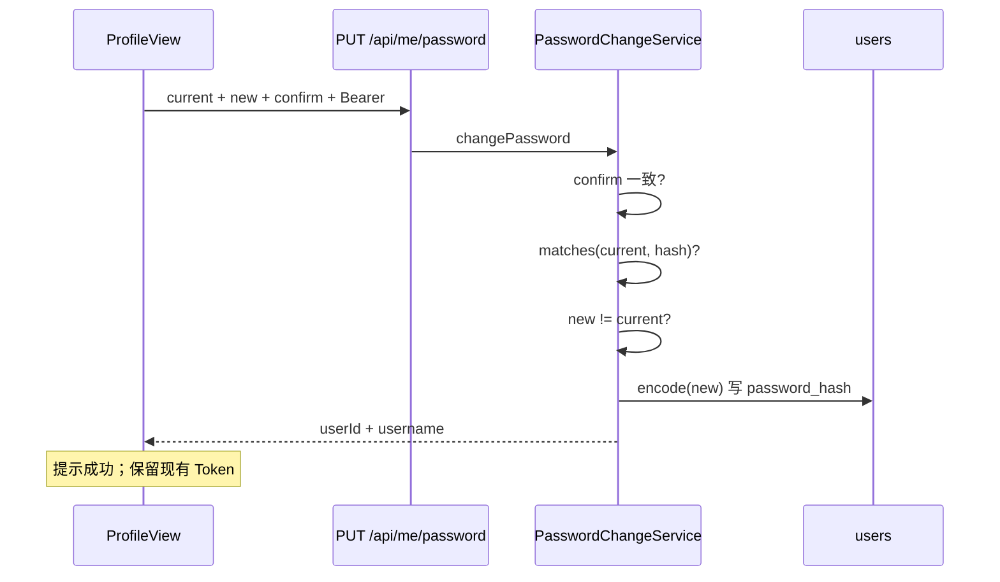

# Plan: 登录密码修改

> 基于：specs/blog-password-change/spec.md v1.2（Implemented）  
> 状态：Implemented  
> 最后更新：2026-07-15

---

## 1. 方案概述

在既有 `/api/me` 与 BCrypt 登录链路上补齐**本人改密**，不改用户表结构、不改 JWT 签发与角色：

- 新增 `PUT /api/me/password`（需登录；落在既有 `/api/me/**` → `authenticated()`）
- Body：`currentPassword`、`newPassword`、`confirmPassword`
- Service：校验登录态 → 校验确认一致 → 校验旧密 → 校验新密规则（与注册一致 6～64）→ **拒绝新旧明文相同** → BCrypt 写库
- 成功 `data` 仅含 `userId`、`username`；永不返回密码或哈希
- 前端在 `/profile` 增加「修改密码」表单区块；成功提示，**不**强制清 Token / 重登（对齐 Spec Non-Goals）
- 验收：`PasswordChangeTests` + `scripts/acceptance-password-change.mjs`

不做邮箱找回、管理员代改、改密后服务端吊销 Access。

---

## 2. 架构设计

### 2.1 模块划分

| 模块 | 职责 |
| --- | --- |
| `user.ChangePasswordRequest` | Body DTO：`currentPassword` / `newPassword` / `confirmPassword`；Jakarta 校验 |
| `user.ChangePasswordResponse` | 成功 `data`：`userId`、`username` |
| `user.PasswordChangeService` | 改密业务：旧密比对、强度、新旧相同拒绝、BCrypt 更新；Service 层取当前用户 |
| `user.MeController` | 增补 `PUT /api/me/password` |
| `auth.PasswordEncoder`（既有） | 复用；不新建 Encoder Bean |
| `config.SecurityConfig` | **无需改**：已有 `/api/me`、`/api/me/**` → `authenticated()` |
| 前端 `api/profile.js` | 增补 `changePassword(payload)` |
| 前端 `ProfileView.vue` | 「修改密码」分区：当前 / 新 / 确认；`type=password`；成功/失败提示 |
| 验收 | `PasswordChangeTests` + `scripts/acceptance-password-change.mjs` |

不新建 domain 包名；改密落在既有 `user` 包，与资料接口同属「本人」面。

### 2.2 数据模型

**无 schema 变更。** 继续使用 `users.password_hash`。

| 决策 | 说明 |
| --- | --- |
| 存密 | 仅 BCrypt 哈希；与注册/登录一致 |
| 角色 / 用户名 | 改密不修改 `username`、`role`、资料字段 |
| JWT | 改密**不**轮换 Token、**不**拉黑；既有 Access 过期前仍可用 |

### 2.3 接口定义

| 方法 | 路径 | 鉴权 | 说明 |
| --- | --- | --- | --- |
| PUT | `/api/me/password` | 登录 | 修改本人密码 |

**PUT Body（`ChangePasswordRequest`）**

| 字段 | 类型 | 必填 | 说明 |
| --- | --- | --- | --- |
| `currentPassword` | string | 是 | 当前登录密码；`@NotBlank` |
| `newPassword` | string | 是 | 新密码；`@NotBlank` + `@Size(min = 6, max = 64)`（与 `RegisterRequest.password` 对齐） |
| `confirmPassword` | string | 是 | 须与 `newPassword` 完全一致；`@NotBlank` |

锁定：**后端强制校验** `confirmPassword`（非仅前端）。

**成功响应**

```json
{
  "code": 0,
  "message": "ok",
  "data": {
    "userId": 1,
    "username": "alice"
  }
}
```

**错误约定（锁定）**

| 场景 | HTTP / code | message 示例 |
| --- | --- | --- |
| 未登录 / Token 无效 | 401 | 既有未认证文案 |
| Bean Validation 失败（空、长度） | 400 | 既有校验消息（如 `password 长度需在 6～64` 风格；新密字段 message 用「新密码长度需在 6～64」） |
| `confirmPassword` ≠ `newPassword` | 400 | `两次输入的新密码不一致` |
| 当前密码不正确 | 400 | `当前密码不正确`（**不用** 401，以便与未登录区分） |
| 新密码与当前密码相同（明文） | 400 | `新密码不能与当前密码相同` |
| 其它 | 500 | 既有；不暴露内部细节、不回显密码 |

旧密错误时**不得**更新 `password_hash`。

### 2.4 校验与业务规则（锁定）

`PasswordChangeService.changePassword`：

1. `CurrentUserService.requireUser()` 取当前用户；未登录由 Security / require 路径返回 401  
2. 若 `confirmPassword` 与 `newPassword` 不一致 → 400（若 Bean Validation 已拦，Service 再兜底一次亦可）  
3. `passwordEncoder.matches(currentPassword, user.passwordHash)`；失败 → 400「当前密码不正确」  
4. 若 `newPassword.equals(currentPassword)` → 400「新密码不能与当前密码相同」  
5. `newPassword` 长度已由 `@Size(6,64)` 保证；与注册一致，**无**额外复杂度规则  
6. `user.setPasswordHash(passwordEncoder.encode(newPassword))`；`userRepository.save`  
7. 返回 `ChangePasswordResponse(userId, username)`  
8. **禁止**日志打印任何密码字段或哈希全文

### 2.5 Security

- 路径已被 `/api/me/**` 覆盖，**不改** `SecurityConfig`  
- 无「按 userId 改他人密码」接口；只能改 JWT 对应用户  
- 错误响应 body 不得包含请求中的密码原文

### 2.6 关键流程



### 2.7 前端（锁定）

| 位置 | 变更 |
| --- | --- |
| `api/profile.js` | `changePassword({ currentPassword, newPassword, confirmPassword })` → `PUT /me/password` |
| `ProfileView.vue` | 在资料表单**下方**增加独立「修改密码」区块（独立 submit，不与资料保存混提）：当前密码、新密码、确认新密码；`type="password"`；`autocomplete` 分别为 `current-password` / `new-password` |
| 成功 UX | 清空三字段；展示成功文案（如「密码已修改」）；**不**调用 `clearAuth`、**不**强制跳转登录 |
| 失败 UX | 展示后端 `message`；不回显已输入密码到成功态以外的明文区域 |
| 路由 | 不新增路由；入口即既有 `/profile`（需登录，沿用现网守卫） |

### 2.8 验收手段

1. **后端测试**：`PasswordChangeTests`  
   - 登录 → 改密成功 → 新密登录成功、旧密登录失败；响应无 `password` / `passwordHash`  
   - 旧密错误 → 400；随后旧密仍可登录  
   - 确认不一致 / 新密过短 / 新旧相同 → 400  
   - 未登录 → 401  
2. **脚本**：`scripts/acceptance-password-change.mjs`  
   - 注册或登录 → 改密 → 新旧密登录断言  
3. **手工**：资料页改密区块可见；成功提示；失败提示可读（对应 AC-8）

---

## 3. 技术选型

| 决策点 | 选型 | 理由 |
| --- | --- | --- |
| 路径 | `PUT /api/me/password` | 属本人资源子资源；Security 已覆盖 |
| HTTP 方法 | PUT | 幂等语义「将密码替换为…」；与资料 PUT 风格一致 |
| 确认字段 | 后端必收并校验 | Spec AC-2；防仅前端校验被绕过 |
| 旧密错误码 | 400 非 401 | 已认证但凭证校验失败，与未登录区分 |
| 新旧相同 | **强制拒绝** | Spec AC-5 Plan 锁定为必做 |
| 改密后会话 | 保留 Access JWT | Non-Goals；留给 auth-refresh |
| Service 归属 | `user.PasswordChangeService` | 与 `MeController` 同包；避免 `AuthService` 膨胀 |
| 前端入口 | `/profile` 内嵌区块 | 无新路由；满足 AC-8 |

---

## 4. 风险与备选方案

| 风险 | 缓解 |
| --- | --- |
| 改密后旧 Token 仍可用 | Spec 明确接受；文档与成功提示可不强调「须重登」；后续 `blog-auth-refresh` 再做吊销 |
| 与注册长度漂移 | 锁定 6～64，与 `RegisterRequest` 同数字；Task 注明对照 |
| 日志误打 Body | 不自定义 access log 打 body；异常 message 不含密码 |
| 管理端种子 admin 改密 | 允许本人改密；测试用独立用户，避免污染默认 `admin123` 约定（acceptance 用临时用户） |

**备选（不采用）**：`POST /api/auth/change-password`——与「me」面分裂，且需重复挂 Security。

---

## 5. 与 Constitution 的对齐检查

- [x] 不引入 ES / Redis / MQ / OSS SDK / SSR
- [x] 统一 `{ code, message, data }`；权限在 Service + Security
- [x] 密码仅 BCrypt；密码与 Token 全文不进日志；响应无 hash
- [x] domain 落在既有 `user`（+ 复用 `auth` 的 Encoder / CurrentUser）
- [x] 关键路径可自动化验收；前端入口用手工清单补充
- [x] PR / 提交说明引用 `blog-password-change` 与 Task 编号

---

## 6. 变更记录

| 版本 | 日期 | 变更说明 |
| --- | --- | --- |
| v1.0 | 2026-07-15 | 初稿 Approved；锁定 `PUT /api/me/password`、三字段 Body、强制确认与新旧相同拒绝、400 旧密错误、资料页入口、不吊销 Token |
| v1.1 | 2026-07-15 | Implemented；`PasswordChangeTests` 通过 |
