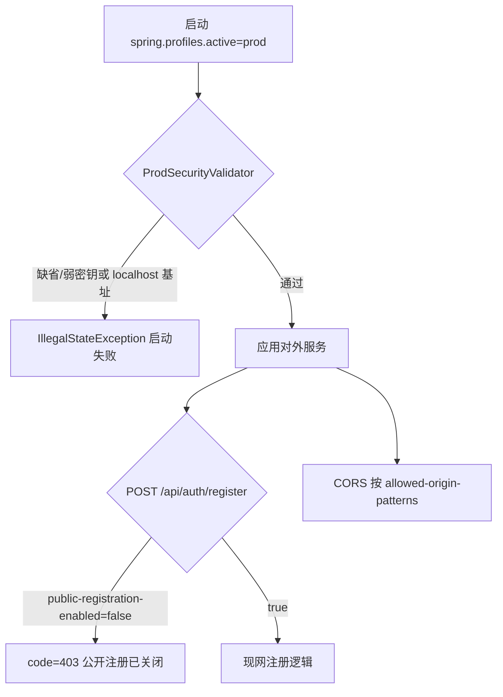

# Plan: 生产配置硬化

> 基于：specs/blog-prod-hardening/spec.md v1.2（Implemented）  
> 状态：Implemented  
> 最后更新：2026-07-15

---

## 1. 方案概述

在**不引入** Docker / Nginx / Redis / 限流中台的前提下，交付公网上线前的应用侧硬化：

1. **`prod` profile**：`application-prod.yml` 将 `ddl-auto` 设为 `validate`、日志 INFO；`JWT_SECRET` / `DB_PASSWORD` / `ADMIN_PASSWORD` **无 YAML 默认值**（须 env）；启动时 `ProdSecurityValidator` 拒绝缺省或已知不安全默认值 → **启动失败**
2. **CORS 可配**：`blog.cors.allowed-origin-patterns`；开发保留 localhost；生产由 env 注入真实 Origin
3. **公开注册开关**：`blog.auth.public-registration-enabled`；Service 层强制；生产默认 `false`；公开站点响应下发开关供前端隐藏入口
4. **上线清单 + `.env.example`**：覆盖第十章 §2.3～2.4；与后续 `blog-ops-docker` 共用 env 名约定

不做反代/HTTPS/Compose、登录限流、找回密码、Flyway 迁移框架。

---

## 2. 架构设计

### 2.1 模块划分

| 模块 | 职责 |
| --- | --- |
| `application.yml` | 开发默认：保留现有 localhost CORS、ddl `update`、DEBUG、注册开启、密钥带开发默认 |
| `application-prod.yml` | 生产覆盖：ddl `validate`、日志 INFO、密钥/口令无默认、注册默认关、CORS 来自 env |
| `config.CorsProperties` | `blog.cors.allowed-origin-patterns`（`List<String>`） |
| `config.CorsConfig` | 改为读取 `CorsProperties`，不再写死 Origin |
| `config.AuthProperties`（或等价） | `blog.auth.public-registration-enabled`（boolean） |
| `config.ProdSecurityValidator` | `@Profile("prod")`；启动校验 JWT/DB/ADMIN；失败抛异常阻止对外服务 |
| `auth.AuthService#register` | 开关关闭 → `BusinessException(FORBIDDEN, …)`，不落库 |
| `site.SiteSettingsResponse` / `SiteService` | 公开响应增补 `publicRegistrationEnabled`（来自配置，非 DB） |
| `config.AppConfig` | `@EnableConfigurationProperties` 注册新 Properties |
| 前端 `useSiteSettings` / Header / Register / admin Login | 按开关隐藏注册链；直达 `/register` 时展示关闭说明 |
| 文档 | `.env.example`；`docx/上线检查清单.md`；`docx/启动方式.md` 补一句生产指向 |
| 验收 | `ProdHardeningTests` + `scripts/acceptance-prod-hardening.mjs` |

不新建 domain 包；硬化落在既有 `config` / `auth` / `site`。

### 2.2 配置与 Profile（锁定）

| 项 | 锁定值 |
| --- | --- |
| Profile 名 | **`prod`** |
| 激活方式 | `spring.profiles.active=prod`（或 `SPRING_PROFILES_ACTIVE=prod`） |
| 开发（无 prod） | 行为与现网一致；本地仍按 `docx/启动方式.md` 启动 |

**`application-prod.yml` 锁定要点**

```yaml
spring:
  datasource:
    password: ${DB_PASSWORD}
  jpa:
    hibernate:
      ddl-auto: validate

blog:
  admin:
    password: ${ADMIN_PASSWORD}
  jwt:
    secret: ${JWT_SECRET}
  auth:
    public-registration-enabled: ${BLOG_PUBLIC_REGISTRATION_ENABLED:false}
  cors:
    allowed-origin-patterns: []   # 由环境变量覆盖；见下
  site:
    base-url: ${BLOG_SITE_BASE_URL}

logging:
  level:
    root: INFO
    com.example.blog: INFO
```

| 项 | 锁定 |
| --- | --- |
| `ddl-auto` | **`validate`**（不为 `update` / `create`）；首发前库结构须已由开发期 `update` 或手工对齐；本期**不引入** Flyway |
| 日志 | root 与 `com.example.blog` 均为 **INFO** |
| 生产注册默认 | **`false`**（可被 env 显式打开） |
| 开发注册默认 | **`true`**（写在主 `application.yml`，保持现网） |

**环境变量约定（锁定名，供 ops 复用）**

| 变量 | 必填（prod） | 说明 |
| --- | --- | --- |
| `JWT_SECRET` | 是 | ≥32 字符；禁止等于开发默认串 |
| `DB_PASSWORD` | 是 | 禁止空；禁止等于 `root` |
| `ADMIN_PASSWORD` | 是 | 禁止等于 `admin123`（仅约束种子用配置；已存在库中的旧哈希须靠清单换密） |
| `BLOG_SITE_BASE_URL` | 是 | 公网 HTTPS 根，如 `https://blog.example.com` |
| `BLOG_CORS_ALLOWED_ORIGIN_PATTERNS` | 按需 | 逗号分隔 Origin 模式；前后端同域反代时可留空 |
| `BLOG_PUBLIC_REGISTRATION_ENABLED` | 否 | 默认 false；`true` 开放注册 |

仓库仅提交 `.env.example`（占位），**禁止**真实密钥。

### 2.3 启动校验（锁定）

`ProdSecurityValidator`（`@Component` + `@Profile("prod")` + 高优先级 `ApplicationRunner` 或 `InitializingBean`）：

| 检查 | 失败行为 |
| --- | --- |
| `JWT_SECRET` 空白 | 抛 `IllegalStateException`，上下文启动失败 |
| secret 等于开发默认 `blog-mvp-jwt-secret-key-change-me-32bytes-min` | 同上 |
| secret 长度 &lt; 32 | 同上 |
| `ADMIN_PASSWORD` 空白或等于 `admin123` | 同上 |
| `DB_PASSWORD` 空白或等于 `root` | 同上 |
| `BLOG_SITE_BASE_URL` 空白或仍含 `localhost` | 同上（生产基址必须是可对外的非 localhost URL） |

**禁止**「仅打 warn 后继续用默认密钥」。  
非 `prod` profile：**不运行**该 Validator，开发默认值可用。

### 2.4 CORS（锁定）

| 项 | 锁定 |
| --- | --- |
| 配置键 | `blog.cors.allowed-origin-patterns` |
| 类型 | `List&lt;String&gt;`（Spring Origin Pattern，如 `https://blog.example.com`、`http://localhost:*`） |
| 环境变量 | `BLOG_CORS_ALLOWED_ORIGIN_PATTERNS`：逗号分隔，trim 后拆成列表（Properties setter 或小转换器） |
| 开发默认（主 yml） | `http://localhost:*`、`http://127.0.0.1:*` |
| 生产默认 | 空列表；同域反代时浏览器不跨域，无需 CORS；分域部署时必须配置 |
| 行为 | 仅列表中的 pattern 放行；未列出的 Origin 不放行（可测） |
| credentials / methods | 保持现网：`allowCredentials=true`；常用方法 + OPTIONS；仍只挂 `/api/**` |

### 2.5 公开注册开关（锁定）

| 项 | 锁定 |
| --- | --- |
| 配置键 | `blog.auth.public-registration-enabled` |
| 关闭时 | `AuthService.register` 开头抛 `BusinessException(ErrorCode.FORBIDDEN, "公开注册已关闭")`；**不**创建用户 |
| HTTP | 与现网业务异常一致：HTTP **200** + body `{ code: 403, message: "公开注册已关闭", data: null }`（本仓库不映射 HTTP 403；Spec 的「业务拒绝」以此为准） |
| Security | **保持** `POST /api/auth/register` `permitAll`（由 Service 拒绝，保证统一 JSON） |
| 开启时 | 与现网一致（用户名唯一、密码规则、AUTHOR、双令牌登录响应） |

**公开下发（锁定）**

- `GET /api/site` 的 `data` 增补布尔字段 **`publicRegistrationEnabled`**（读配置，非站点表）
- 前端：`useSiteSettings` 映射该字段
- `SiteHeader`、管理端登录页「去注册」：为 `false` 时**不渲染**注册链接
- `RegisterView`：若为 `false`，展示「当前不开放注册」类说明并禁用提交（避免死胡同）；仍可能被直接打开路由

### 2.6 前端与文档（锁定）

| 交付物 | 内容 |
| --- | --- |
| `.env.example` | 列出 §2.2 全部变量与注释；无真实值 |
| `docx/上线检查清单.md` | 勾选清单：§2.3 产品卫生 + §2.4 冒烟（配置侧可先验；HTTPS/反代项标注「依赖 blog-ops-docker」） |
| `docx/启动方式.md` | 文末增加「生产：使用 `prod` profile + 见上线检查清单 / `.env.example`」短节；**不改变**本地三步启动主路径 |

清单至少含：

- 已设强 `JWT_SECRET` / `DB_PASSWORD` / `ADMIN_PASSWORD`；默认 `admin123` 不可登录（或已改密）
- `BLOG_SITE_BASE_URL` 为 HTTPS 公网；RSS `/feed.xml` 条目链接正确（部署后勾）
- 站点名 / 简介 / 关于 / 友链 / 真实内容；评论审核可用；上传资源在生产域名可访问
- 注册策略决策（关 → 可跳过 `blog-auth-recovery`；开 → 上线后摘取）
- 未登录访问管理写接口 401；关键页冒烟（HTTPS 项可暂标 ops）

### 2.7 关键流程



### 2.8 验收手段

1. **后端 `ProdHardeningTests`**
   - 断言 `application-prod.yml`（或 `@ActiveProfiles("prod")` + 测试属性）下：ddl/日志意图可通过 Environment 读取；或对 Validator 做单元/上下文测试
   - **启动失败**：`prod` + 默认 JWT / 缺 `JWT_SECRET` → 上下文启动失败（可用 `SpringApplication` / `ApplicationContextRunner`）
   - 注册关闭：`BLOG_PUBLIC_REGISTRATION_ENABLED=false`（或测试属性）→ `POST /api/auth/register` → `code=403`，用户未创建；开启时仍可注册
   - 公开 `GET /api/site` 含 `publicRegistrationEnabled`
   - CORS：配置自定义 pattern 后，`CorsConfigurationSource` 对允许 Origin 匹配、对未列 Origin 不匹配（单测或 MockMvc OPTIONS）
2. **脚本 `scripts/acceptance-prod-hardening.mjs`**
   - 在默认可跑的开发后端上：断言 site 含 `publicRegistrationEnabled`；若当前为 true 则注册仍可用（冒烟）
   - 文档说明：完整「缺 JWT 启动失败」以测试类为准（脚本不强制起 prod 进程）
3. **手工 / 清单**：按 `docx/上线检查清单.md` 走读一遍可勾选
4. **构建**：后端相关测试通过；前端 `npm run build` 通过

---

## 3. 技术选型

| 决策点 | 选型 | 理由 |
| --- | --- | --- |
| Profile | Spring `prod` + `application-prod.yml` | 零新框架；与 Boot 惯例一致 |
| 缺密钥行为 | **启动失败**（Validator + YAML 无默认） | Spec 禁止带病运行；比仅文档检查硬 |
| ddl | `validate` | 防生产静默改表；比 `none` 更能尽早暴露漂移 |
| 注册关闭码 | 业务 `code=403` + 统一 Result | 对齐现有 `BusinessException` 习惯，前端已认 `message` |
| 注册开关下发 | 并入 `GET /api/site` | 无新公开端点；Header 易读 |
| 前端入口 | 隐藏链接 + RegisterView 禁用 | 双保险，避免死胡同 |
| 清单路径 | `docx/上线检查清单.md` | 与需求第十章同层文档；ops 可直接引用 |
| env 示例 | 仓库根 `.env.example` | 供后续 Compose 直接对齐 |

---

## 4. 风险与备选方案

| 风险 | 缓解 |
| --- | --- |
| `validate` 与本地库结构不一致导致 prod 起不来 | 清单写明：先用开发/`update` 对齐 schema，再切 prod；文档不引入 Flyway |
| 已存在 admin 仍为 `admin123` 哈希 | Validator 只拦配置值；清单强制改密或重建；`ADMIN_PASSWORD` 仅影响**首次种子** |
| 同域反代下 CORS 空列表 | 接受；分域时必须配 `BLOG_CORS_ALLOWED_ORIGIN_PATTERNS` |
| 测试误激活 prod 导致全套测试失败 | 测试默认仍用 test yml；hardening 用例显式 `ApplicationContextRunner` / 独立测例 |
| 前端缓存旧 site 无开关字段 | 缺字段时按「开启」降级或按 `!== false` 处理；Plan 锁定：**缺字段视为 true**（兼容旧后端），有字段则严格按布尔 |

**备选（不采用）**：仅文档检查无启动校验；注册关闭改 404 伪装；引入 Flyway；把 CORS 放到 Nginx 只配、应用不改（个人站前后端分域时应用侧仍需要）。

---

## 5. 与 Constitution 的对齐检查

- [x] 不引入 ES / Redis / MQ / OSS SDK / SSR / Flyway  
- [x] 统一 `{ code, message, data }`；注册关闭在 **Service 层**强制  
- [x] 真实密钥不进仓库；密码 / Token 全文不进日志  
- [x] 关键路径可自动化（测试 + 脚本）；清单覆盖产品卫生  
- [x] 与 ops 的 env 名先定，拓扑留给 `blog-ops-docker`  
- [x] PR / 提交说明引用 `blog-prod-hardening` 与 Task 编号  

---

## 6. 变更记录

| 版本 | 日期 | 变更说明 |
| --- | --- | --- |
| v1.0 | 2026-07-15 | Approved；锁定 prod profile、启动失败校验、validate+INFO、CORS 可配、注册开关+site 下发、清单与 `.env.example` |
| v1.1 | 2026-07-15 | Implemented；前后端与验收齐套 |
