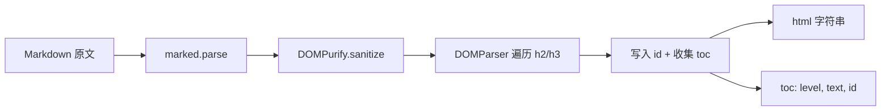
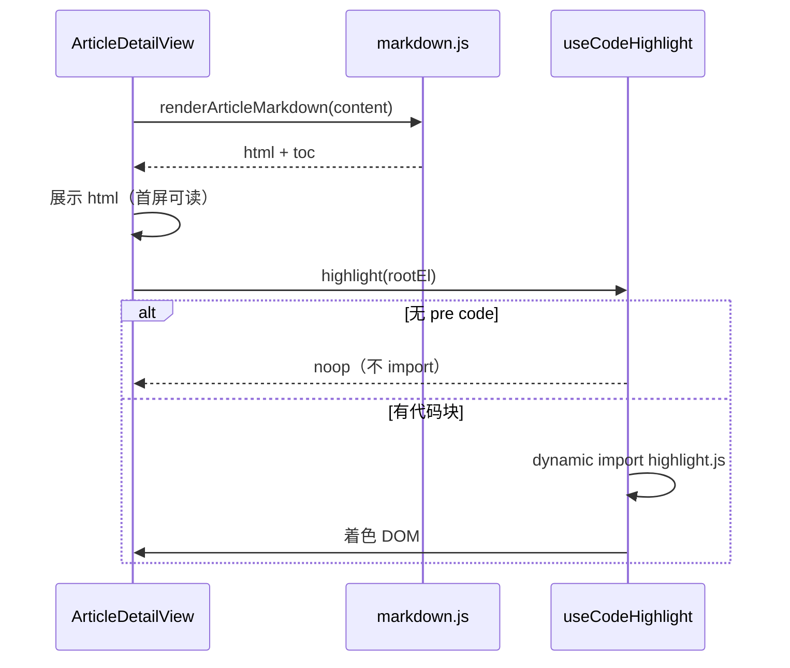

# Plan: 阅读体验打磨

> 基于：specs/blog-reading-ux/spec.md v1.2（Implemented）  
> 状态：Done  
> 最后更新：2026-07-14

---

## 1. 方案概述

**纯前端增量**，不改后端 API / 状态机 / 权限。在现有 `marked` + `DOMPurify` 链路上抽出正文渲染工具：消毒后为 `h2`/`h3` 注入稳定 `id` 并导出 TOC；详情页挂载目录组件；代码高亮用 `highlight.js` **动态按需 import**，无代码块不加载；列表/详情用局部骨架组件替换「加载中…」；列表按是否有 `keyword` 区分空态文案与恢复操作。

---

## 2. 架构设计

### 2.1 模块划分

| 模块 | 职责 |
| --- | --- |
| `frontend/src/utils/markdown.js` | `renderArticleMarkdown(md)` → `{ html, toc }`；slug / 重名去重 |
| `frontend/src/composables/useCodeHighlight.js` | 检测 `pre code`，动态加载 highlight.js 并着色 |
| `frontend/src/components/ArticleToc.vue` | 可点击 TOC；无项时不渲染根节点 |
| `frontend/src/components/ArticleListSkeleton.vue` | 列表卡片形骨架（约 3～5 条） |
| `frontend/src/components/ArticleDetailSkeleton.vue` | 详情标题/元信息/正文区占位 |
| `ArticleDetailView.vue` | 接入 TOC、骨架、高亮；保留评论简单加载文案 |
| `ArticlesView.vue` | 接入列表骨架；搜索空态 vs 通用空态 |

无新表、无新 Controller、无新 REST 路径（AC-10）。

### 2.2 正文渲染与 TOC（HOW）



要点：

1. **顺序**：先 `marked` → 再 `DOMPurify` → 再在**已消毒** DOM 上写 `id` 与抽 TOC，避免「带锚点的未消毒 HTML」入页
2. **标题范围**：本期只收录 `h2`、`h3`（`h1` 通常是文题，避免与页面 `<h1>` 重复进 TOC）
3. **id 生成**：
   - 优先：标题文本 trim → 小写 → 空白转 `-` → 保留中英文数字与 `-`；空结果则用 `section`
   - 重名：同文内第二次起后缀 `-2`、`-3`…
   - 禁止以数字开头时加前缀 `h-`（兼容 CSS/`querySelector`）
4. **DOMPurify**：显式允许标题保留 `id`（若默认已允许可不再改；实现时用含 `id` 的样本断言消毒后仍在）
5. **跳转**：TOC 点击 `preventDefault` + `element.scrollIntoView({ behavior: 'smooth', block: 'start' })`；同步 `history.replaceState` 更新 hash（可选，Plan 推荐做，便于分享锚点）
6. **空 TOC**：`toc.length === 0` 时 `ArticleToc` 返回空（`v-if="toc.length"`），满足 AC-3

布局建议：桌面端 TOC 置于正文上方折叠列表或文首「目录」块（不强制 sticky 侧栏，避免大改 `content-article` 宽度）；窄屏同样文首展示即可。

### 2.3 代码高亮（HOW）

| 决策 | 选择 |
| --- | --- |
| 库 | `highlight.js`（BSD-3；生态成熟；可按语言分包） |
| 加载 | `import()` 动态导入；**仅当**正文容器内存在 `pre code` |
| 时机 | 正文 `v-html` 已上屏后的 `nextTick` / `watch(html)`；先可见朴素 `<pre>`，再替换 class/着色 |
| 语言 | 注册常用：`javascript`、`typescript`、`java`、`xml`/`html`、`css`、`json`、`bash`、`sql`、`markdown`、`python`；未知 → `highlightAuto` 或原样 |
| 样式 | 引入一份轻量主题 CSS（如 `github` 或自写变量色），写入全局或详情 scoped `:deep`，融入 `--border-soft` / 现有 `pre` 底色 |
| 包体 | 使用 `highlight.js/lib/core` + 按语言 `registerLanguage`，避免全量 bundle |

流程：



高亮只改 `code` 内文本节点包装的 `<span class="hljs-*">`，不重新解析未消毒 Markdown。

### 2.4 骨架与空态

**列表骨架**（`ArticlesView`）：`loading === true` 时渲染 `ArticleListSkeleton`（仿 `ArticleCard`：左侧方块 + 右侧多行灰条），隐藏真实列表与分页操作区或禁用分页。

**详情骨架**（`ArticleDetailView`）：`loading === true` 时渲染 `ArticleDetailSkeleton`（封面条可选、标题条、元信息条、多行正文条）。

骨架样式：`background: linear-gradient` 微光动画或静态 `rgba` 灰块；使用现有 `--radius-lg`、`--shadow-card`，避免 Element Plus 骨架（访客端不引入管理端组件）。

**空态**（`ArticlesView`，`!loading && !error && articles.length === 0`）：

| 条件 | 文案（可微调） | 操作 |
| --- | --- | --- |
| `keyword.trim()` 非空 | 「没有找到与「{keyword}」匹配的文章」 | 主按钮：清空关键词（保留分类/标签可选）或「清空筛选」→ 现有 `clearFilters` |
| 无 keyword | 「暂无文章」或「当前筛选下暂无文章」 | 若有分类/标签/归档：提供「清空筛选」；全无筛选时可无按钮 |

满足 AC-8 / AC-9 文案可区分即可。

### 2.5 接口与数据

无变更。详情仍 `GET /api/articles/{id}` 返回 Markdown `content`；列表仍 `GET /api/articles`。

### 2.6 验收手段

| 类型 | 内容 |
| --- | --- |
| 手工走查 | 见 §2.7 清单；Tasks 勾选 |
| 可选脚本 | 不强制 E2E；若有余力可对 `markdown.js` 用 Node 单测或小型 `scripts/acceptance-reading-ux-md.mjs` 断言：多标题 toc 长度、重名 id、危险 HTML 经 purify 后无 `<script>` |
| 回归 | 含 `<script>alert(1)</script>` 与 `` 的 MD 样本打开详情，DevTools 确认未执行 |

### 2.7 手工走查清单

1. 含 ≥3 个 `##` / `###` 的长文：TOC 项数正确；点击滚到对应标题；重名标题 id 不冲突
2. 无二级/三级标题的短文：无 TOC 区域
3. 含 ```` ```js ```` 代码块：正文先出现，随后高亮；Network 可见 highlight 异步 chunk
4. 无代码块文章：Network **无** highlight 相关 chunk
5. 危险 MD 样本：脚本不执行
6. 限速下打开列表/详情：见骨架而非仅一行「加载中…」
7. 搜索不存在关键词：搜索空态 + 可清空；无 keyword 的空分类：通用空态文案不同

---

## 3. 技术选型

| 决策点 | 选型 | 理由 |
| --- | --- | --- |
| TOC 生成时机 | 消毒后 DOM 遍历 | 安全；不依赖 marked 自定义 renderer 与 purify 顺序博弈 |
| 高亮库 | highlight.js core + 常用语言 | 体积可控、动态 import 简单；胜过全量 Prism/Shiki |
| 骨架 | 自写 Vue 组件 + CSS | 访客端无 Element；贴合 ArticleCard 轮廓 |
| 空态 | 条件分支文案 | 改动最小；不强制抽 EmptyState 除非复用明显 |
| 后端 | 不动 | Spec AC-10 |

备选（不采用）：Shiki（更重、偏构建期）；服务端 TOC 字段（Non-Goals）。

---

## 4. 风险与备选方案

| 风险 | 影响 | 缓解 |
| --- | --- | --- |
| DOMPurify 剥掉 `id` | TOC 无法跳转 | 配置 `ADD_ATTR: ['id']` 或 `HOOKS`；用样本测 |
| highlight 全量误引入 | 首包变大 | 强制 `lib/core` + 动态 import；构建后目视 chunk |
| 中文标题 slug 怪异 | id 难读 | 允许 Unicode slug 或退回 `section-N`；功能优先于美观 |
| `scrollIntoView` 被固定顶栏遮挡 | 标题被挡 | `scroll-margin-top: var(--header-height)` 加在 `.markdown-body :is(h2,h3)` |
| 高亮与 Vue 再次渲染打架 | 着色丢失 | `watch` html 变化后重新 `highlight`；避免对同一节点重复包一层 |

---

## 5. 与 Constitution 的对齐检查

- [x] 不引入 SSR / Nuxt / Elasticsearch / Redis
- [x] Markdown→HTML 仍经 DOMPurify；TOC 在消毒后注入 id
- [x] 无新公开 API；无 SQL；无状态机变更
- [x] 关键路径有走查清单（+ 可选 MD 工具脚本）
- [x] 访客端自写 CSS，沿用设计变量

---

## 6. 变更记录

| 版本 | 日期 | 变更说明 |
| --- | --- | --- |
| v1.0 | 2026-07-14 | 初稿 Approved；TOC / hljs 动态加载 / 骨架 / 搜索空态 |
| v1.1 | 2026-07-14 | 实现完成；Tasks Done；验收脚本 + build 通过 | |
