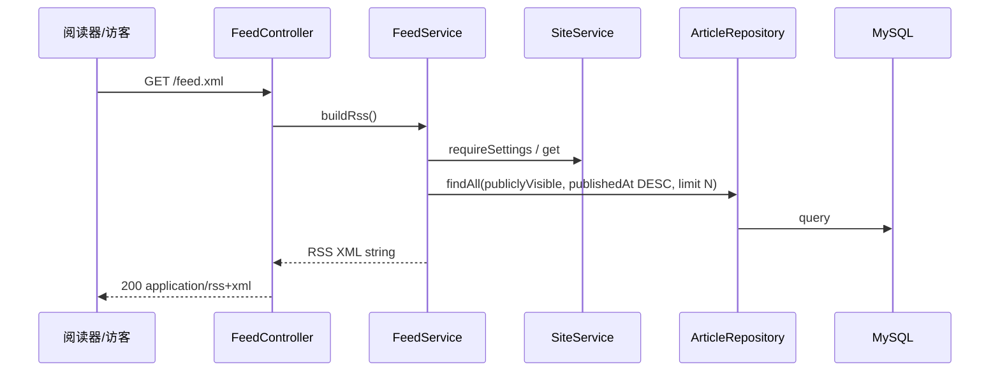

# Plan: RSS / Atom 订阅源

> 基于：specs/blog-rss-feed/spec.md v1.2（Implemented）  
> 状态：Implemented  
> 最后更新：2026-07-14

---

## 1. 方案概述

新增公开 **RSS 2.0** 订阅源（本期不输出 Atom）。后端提供 `GET /feed.xml`，返回 UTF-8 XML（**不**包 `Result`）；条目为最近 **20** 篇公开可见已发布文章（标题、绝对链接、摘要、`publishedAt`）；频道 `title` / `description` 取自 `SiteService` 的 `siteName` / `tagline`。绝对 URL 依赖配置项 `blog.site.base-url`。访客端在 `<head>` 增加 `rel="alternate"`，页脚增加订阅链接。不改文章状态机与既有 JSON API。

---

## 2. 架构设计

### 2.1 模块划分

| 模块 | 职责 |
| --- | --- |
| `config.BlogSiteProperties`（或等价） | 绑定 `blog.site.base-url`、`blog.site.feed-limit` |
| `feed.FeedService` | 拉取站点配置 + 最近 N 篇公开文章；组装 RSS 2.0 XML 字符串 |
| `feed.FeedController` | `GET /feed.xml`，`produces = application/rss+xml;charset=UTF-8` |
| `article.ArticleService#listPublishedForFeed` | 复用 `publiclyVisible`；按 `publishedAt DESC` 取前 N（Specs 保持包内） |
| `site.SiteService` | 复用 `get()` / `requireSettings()` 取站名与简介 |
| 访客端 `PublicLayout` / `SiteFooter` | alternate + 页脚入口 |
| Vite proxy | 开发态将 `/feed.xml` 代理到后端 |
| 验收 | `FeedPublicTests` + `scripts/acceptance-rss-feed.mjs` |

无新表。不引入 Rome 等第三方 feed 库（手写 RSS 2.0 + XML escape）。

### 2.2 数据模型

无 schema 变更。配置（`application.yml`）：

```yaml
blog:
  site:
    # 公开站点根 URL（前端源站），无尾斜杠；用于 item link 与 channel link
    base-url: ${BLOG_SITE_BASE_URL:http://localhost:5173}
    # feed 最多条目数；硬上限 50
    feed-limit: ${BLOG_SITE_FEED_LIMIT:20}
```

| 配置 | 默认 | 说明 |
| --- | --- | --- |
| `blog.site.base-url` | `http://localhost:5173` | 拼接 `/articles/{id}` 与 `/feed.xml`；生产用环境变量覆盖 |
| `blog.site.feed-limit` | `20` | 实际 N = `min(配置值, 50)`；非法/≤0 时回退 20 |

**未配置 base-url（空白）**：启动或首次生成 feed 时使用上述本地默认；**禁止**输出相对路径 item link。验收脚本可依赖默认值，或通过环境变量注入。

**不**扩展 `site_settings` 表存 base URL（部署属性，非运营文案）；站名/简介仍走站点配置。

### 2.3 接口定义

| 方法 | 路径 | 说明 |
| --- | --- | --- |
| GET | `/feed.xml` | 公开 RSS 2.0；无查询参数；无需登录 |

**响应**

- Status：`200`
- `Content-Type`：`application/rss+xml;charset=UTF-8`（若容器协商为 `application/xml`，仍须 charset=UTF-8 且正文为合法 RSS）
- Body：RSS 2.0 XML，**非** `{ code, message, data }`

**频道字段映射**

| RSS | 来源 |
| --- | --- |
| `channel/title` | `siteName`（实体默认 `My Blog`） |
| `channel/description` | `tagline`（实体默认「欢迎来到我的小宇宙」） |
| `channel/link` | `{baseUrl}/` 或 `{baseUrl}`（Plan 实现取 `{baseUrl}/`） |
| `channel/lastBuildDate` | 当前生成时间或最新条目 `publishedAt`（RFC-822） |
| 自描述 | 可选 `atom:link rel="self"` **或** 仅依赖 `channel/link`；若加 self，href=`{baseUrl}/feed.xml` |

**条目字段映射**

| RSS | 来源 |
| --- | --- |
| `item/title` | `article.title` |
| `item/link` | `{baseUrl}/articles/{id}`（无 slug） |
| `item/guid` | 同 link，`isPermaLink="true"` |
| `item/description` | 与公开列表一致的摘要：优先非空 `summary`；否则正文截断 120 字 + `…`（复用 `ArticleResponse` 既有 resolve 逻辑，抽私有/包内方法避免重复亦可） |
| `item/pubDate` | `publishedAt`，时区 `Asia/Shanghai`，格式 **RFC-822**（如 `Tue, 14 Jul 2026 15:00:00 +0800`） |

空摘要且正文为空的极端情况：`description` 输出空串（合法）。

**排序与条数**：`publiclyVisible(now)` + `publishedAt DESC`（可不按 pinned，feed 以时间线为准）；取前 N。无文章：仍返回含 `channel` 元数据、无 `item` 的合法 RSS。

### 2.4 关键流程



### 2.5 XML 与转义（HOW）

- 手写文档声明与元素；对 `title` / `description` / 文本节点做 XML escape：`&` `<` `>` `"` `'`
- 不把 Markdown 渲染为 HTML 写入 `description`（纯文本摘要即可）
- 不引入 Rome / Jackson XML（避免依赖膨胀）；单测覆盖含 `&` 的标题

### 2.6 Security 与开发代理

- `SecurityConfig`：`/feed.xml` 已可由 `anyRequest().permitAll()` 覆盖；建议**显式** `permitAll` 一行便于文档化（可选但推荐）
- `frontend/vite.config.js`：增加 `/feed.xml` → `http://localhost:8080` 代理，使 `http://localhost:5173/feed.xml` 与 alternate `href="/feed.xml"` 在开发态可用
- 生产：由网关/Nginx 将 `/feed.xml` 反代到后端（与 `/api` 同属运维约定，本期可不写 Docker）

### 2.7 前端（AC-9）

| 位置 | 变更 |
| --- | --- |
| `PublicLayout.vue`（或 `useSiteSettings` 旁） | `onMounted` 向 `document.head` 插入/更新 `<link rel="alternate" type="application/rss+xml" title="{siteName}" href="/feed.xml">`；卸载时移除（避免重复） |
| `SiteFooter.vue` | 增加「RSS 订阅」链接：`href="/feed.xml"`（可 `target="_blank"`） |
| `index.html` | **不**写死 alternate（站名动态）；避免双份 |

Feed URL 使用**同源相对路径** `/feed.xml`，不经 Axios（非 JSON）。

### 2.8 验收手段

1. **后端测试**（推荐）：`FeedPublicTests`（MockMvc）  
   - 草稿/下架同词不出现；已发布出现  
   - 条数不超过 N；造 N+1 篇只返回 N  
   - `Content-Type` 含 `rss+xml` 或正文以 `<rss` 开头且含 `version="2.0"`  
   - 修改站点名后 channel/title 更新  
   - 标题含 `&` 仍可解析为合法 XML  
2. **脚本**：`scripts/acceptance-rss-feed.mjs`（`API_BASE` 默认 `http://localhost:8080`）  
   - 登录造数 → `GET /feed.xml` 取 text → 断言条目与可见性、站名

---

## 3. 技术选型

| 决策点 | 选型 | 理由 |
| --- | --- | --- |
| 格式 | **RSS 2.0 only** | 阅读器兼容面大；Spec 允许二选一 |
| 路径 | `/feed.xml`（非 `/api/**`） | 经典订阅 URL；明确 JSON 例外 |
| base URL | `application.yml` / 环境变量 | 部署配置，无需管理端 CRUD |
| N | 默认 20，硬上限 50 | 与公开列表 `MAX_SIZE` 同量级 |
| 摘要 | 复用公开列表 resolve | 与前台列表一致（AC-5） |
| XML 实现 | 手写 + escape | 无新依赖；结构简单 |
| 发现入口 | head alternate **+** 页脚 | Spec 允许两者；成本低 |

---

## 4. 风险与备选方案

| 风险 | 影响 | 缓解措施 |
| --- | --- | --- |
| base-url 配成后端端口 | 读者点击进 API/404 | 文档写明须为**前端源站**；本地默认 5173 |
| 开发未配 Vite 代理 | 5173 上 `/feed.xml` 404 | Task 含 proxy；验收可直打 8080 |
| RFC-822 时区错误 | 阅读器时间偏移 | 固定 `Asia/Shanghai`；测试断言 `+0800` 或等价 |
| 摘要过长/特殊字符 | XML 损坏 | escape + 单测；截断逻辑复用现有 120 |
| 未来要 Atom | 双源非本期 | 另开微小变更或修订 Spec |

备选（本期不采用）：扩展 `site_settings.public_base_url` 供 ADMIN 配置——运维改 yml/环境变量即可，避免管理端范围膨胀。

---

## 5. 与 Constitution 的对齐检查

- [x] 不引入 Elasticsearch / Redis / 消息队列 / OSS / SSR
- [x] 查询用 JPA Specification / 参数化，无 SQL 拼接
- [x] feed 为文档化的 JSON 统一响应例外；其它 API 不变
- [x] 可见性在 Service 层强制（复用 `publiclyVisible`）
- [x] 关键路径具备自动化验收（测试 + 脚本）
- [x] 无新中间件；手写 XML 可不改 constitution 技术栈列表

---

## 6. 变更记录

| 版本 | 日期 | 变更说明 |
| --- | --- | --- |
| v1.0 | 2026-07-14 | 初稿；锁定 RSS 2.0、`/feed.xml`、yml base-url、N=20 |
| v1.1 | 2026-07-14 | 与 Spec / Tasks 齐套 Approved |
| v1.2 | 2026-07-14 | Implemented；经 `ArticleService#listPublishedForFeed` 查询 |
