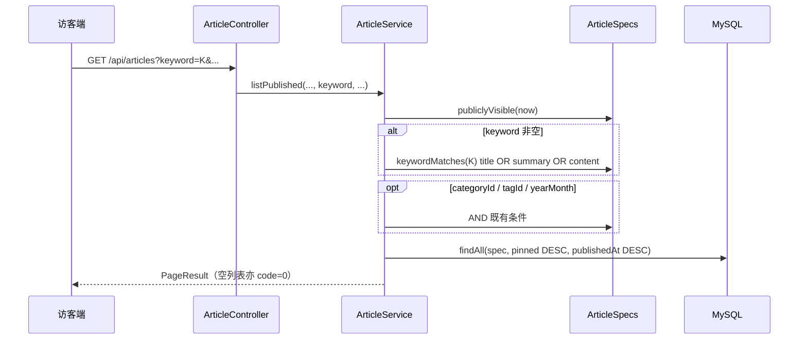

# Plan: 搜索增强

> 基于：specs/blog-search-enhance/spec.md v1.1（Approved）  
> 状态：Approved  
> 最后更新：2026-07-14

---

## 1. 方案概述

不新增独立搜索资源。在现有公开接口 `GET /api/articles` 的 `keyword` 过滤上，将 `ArticleSpecs.titleContains` 扩展为「标题 OR 摘要 OR 正文」的大小写不敏感子串匹配；继续与 `publiclyVisible`、分类/标签/`yearMonth` 以 AND 组合；列表响应与排序不变。访客端仅改搜索相关文案。管理端文章列表当前无 `keyword`，本期不扩展（对应 Spec AC-8）。

---

## 2. 架构设计

### 2.1 模块划分

| 模块 | 职责 |
| --- | --- |
| `article.ArticleSpecs` | 关键词 Specification：三字段 OR |
| `article.ArticleService#listPublished` | 非空 keyword 时挂接新 Spec（逻辑位置不变） |
| 访客端 `ArticlesView.vue` | 占位符与说明文案 |
| 验收 | 测试或 `scripts` 脚本覆盖 Spec 样本用例 |

无新表、无新依赖、无新 Controller 路径。

### 2.2 数据模型

无 schema 变更。检索字段沿用：

| 字段 | 实体属性 | 说明 |
| --- | --- | --- |
| 标题 | `title` | 已有索引 `idx_articles_title`（辅助标题命中，非强制） |
| 摘要 | `summary` | 可空；`NULL` 时该分支不命中即可 |
| 正文 | `content` | Markdown 原文；对 MD 标记做子串匹配可接受 |

### 2.3 接口定义

| 方法 | 路径 | 说明 |
| --- | --- | --- |
| GET | `/api/articles` | **行为变更**：`keyword` 非空时匹配 title / summary / content；其余参数与响应契约不变 |

查询参数（保持现有）：`page`、`size`、`categoryId`、`tagId`、`keyword`、`yearMonth`。

响应：既有 `PageResult` + `ArticleResponse.summary(...)` 列表项，**不新增**高亮字段。

### 2.4 关键流程

### 2.5 Specification 行为（HOW 要点）

- 将 `titleContains` **替换或重命名**为 `keywordMatches`（或保留旧方法名但改为三字段，避免双轨）：
  - `pattern = "%" + keyword.toLowerCase() + "%"`
  - `cb.or(like(lower(title)), like(lower(summary)), like(lower(content)))`
  - `summary` / `content` 为 null 时用 `cb.literal("")` 或仅对非 null 路径 `like`，避免 SQL 异常
- `keyword` blank：不挂接该 Spec（AC-3）
- 公开可见性仍仅 `ArticleSpecs.publiclyVisible`（AC-2）
- **转义**：JPA `like` 对用户输入中的 `%` `_` 可能被当作通配符；本期与 MVP 标题搜索行为一致即可，不强制 escape（若实现时顺手 escape，须在测试中固定约定）

### 2.6 前端

| 位置 | 变更 |
| --- | --- |
| `ArticlesView.vue` | `placeholder`：如「搜索标题、摘要或正文…」；页头说明去掉「仅标题」表述（AC-7） |
| 其它页 | 无强制变更；若首页另有搜索入口，同步文案 |

### 2.7 管理端（AC-8 裁定）

`listAdmin` 当前仅按 `status` 分页，**无 keyword**。本期**不**为管理端增加关键词搜索，避免扩大范围。

### 2.8 验收手段

优先二选一或组合：

1. **后端测试**（推荐）：在现有文章测试风格下新增用例——只在 summary / 只在 content 命中；草稿同词不出现；空结果 `code` 语义若走 MockMvc 则断言 JSON
2. **脚本**：扩展或新增 `scripts/acceptance-search-enhance.mjs`，对运行中的 API 造数并断言（与 `acceptance-standard.mjs` 同模式）

样本数据建议：

| 文章 | status | title | summary | content 含词 |
| --- | --- | --- | --- | --- |
| A | PUBLISHED | 含 `AlphaOnlyTitle` | 无 | 无 |
| B | PUBLISHED | 无该词 | 含 `BetaOnlySummary` | 无 |
| C | PUBLISHED | 无该词 | 无 | 含 `GammaOnlyBody` |
| D | DRAFT | 含 `GammaOnlyBody` | — | — |

断言：`keyword=BetaOnlySummary` 命中 B；`GammaOnlyBody` 公开仅 C 不 D；`NoMatchZZZ` 空列表。

---

## 3. 技术选型

| 决策点 | 选型 | 理由 |
| --- | --- | --- |
| 检索实现 | JPA `Specification` + `LIKE` | 符合 constitution；无新中间件；改动面最小 |
| API 形态 | 扩展现有 `keyword` | Spec 明确优先；避免平行 `/api/search` |
| 大小写 | `lower(column) LIKE lower(pattern)` | 与现网 `titleContains` 一致 |
| 正文匹配对象 | 存库 Markdown 原文 | 实现简单；不要求剥标签 |
| 管理端搜索 | 不做 | AC-8 明确不强制 |

---

## 4. 风险与备选方案

| 风险 | 影响 | 缓解措施 |
| --- | --- | --- |
| `content` 全表 LIKE 变慢 | 文章很多时 P95 升高 | 本期数据量假设 ≤200；后续 `blog-fulltext-es` |
| summary 为 NULL | OR 条件写错导致整查询失败或漏匹配 | 显式处理 null；用 B/C 样本测 |
| 用户输入 `%` `_` | 意外扩大匹配 | 与 MVP 一致；可选后续 escape |
| 前端文案遗漏 | AC-7 失败 | Task 单独勾选文案 |

备选（本期不采用）：MySQL `FULLTEXT` 索引——需 DDL 与中文分词考量，超出「子串包含」Spec，且易越 Non-Goals。

---

## 5. 与 Constitution 的对齐检查

- [x] 不引入 Elasticsearch / Redis / 消息队列 / OSS / SSR
- [x] 无手写 SQL 拼接；使用 Specification 参数化
- [x] 统一响应与 `/api/articles` 公开分区不变
- [x] 可见性仍在 Service + Spec 强制，不依赖前端
- [x] 关键路径具备自动化验收（测试或脚本）

---

## 6. 变更记录

| 版本 | 日期 | 变更说明 |
| --- | --- | --- |
| v1.0 | 2026-07-14 | 初稿 Draft；管理端明确不做 keyword |
| v1.1 | 2026-07-14 | 与 Spec 一并 Approved |
| v1.2 | 2026-07-14 | 实现完成；Tasks Done | |
