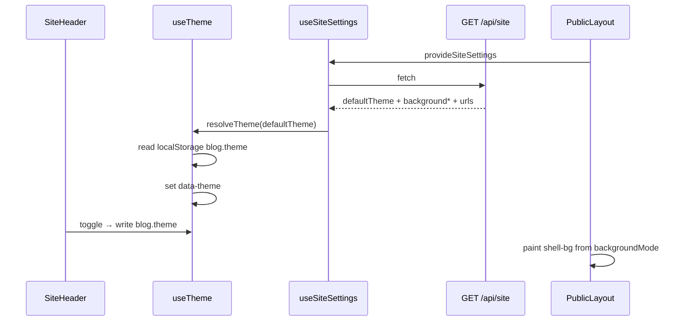

# Plan: 主题切换与访客端视觉氛围

> 基于：specs/blog-theme-switch/spec.md v1.2（Implemented）  
> 状态：Implemented  
> 最后更新：2026-07-15  
> 预览：`specs/blog-theme-switch/效果预览.html`（浏览器直接打开）

---

## 1. 方案概述

在既有站点配置与访客壳层上交付三件事，**不引入** Redis / OSS / SSR：

1. **主题切换**：访客端 `light` / `dark` 双模式（本期不做第三命名预设）；`html[data-theme]` + CSS 变量；偏好键 `blog.theme` 存 `localStorage`；无偏好时用站点 `defaultTheme`，再回落 `light`
2. **默认视觉增强**：重构 `DecorBackground` 为分层氛围；关于页头像框饰组件；首页右侧改为分层贴图组件（主视觉 + 浮动贴纸）
3. **站点级自定义**：扩展 `site_settings` 单例字段；公开 `GET /api/site` 与 `PUT /api/admin/site` 读写；管理端站点设置表单增补；背景图/头像/贴图 URL 复用既有上传

效果目标以 Spec 附录 7.4 与本目录 `效果预览.html` 为对照。

---

## 2. 架构设计

### 2.1 模块划分

| 模块 | 职责 |
| --- | --- |
| `site.SiteSettings` | 增补视觉字段列（见 §2.2） |
| `site.SiteSettingsRequest` / `Response` | 读写新字段；校验枚举与 URL |
| `site.SiteService` | 校验 `defaultTheme` / `backgroundMode` / 色值 / 渐变 id / URL；ADMIN 更新；公开映射 |
| `site.SiteController` | 路径不变；响应自动含新字段 |
| 前端 `composables/useTheme.js` | 读站点默认 + localStorage；`setTheme`；挂 `data-theme` |
| 前端 `style.css` | `[data-theme="light"|"dark"]` 两套 token；壳层渐变底变量 |
| 前端 `DecorBackground.vue` | 分层光斑 + 点阵/星点；随主题变；`prefers-reduced-motion` |
| 前端 `components/AboutAvatar.vue` | 140px 头像 + 渐变双环 + 光晕 + 星点 |
| 前端 `components/HeroArt.vue` | 主视觉（默认 SVG 或自定义 URL）+ 浮动贴纸层 |
| 前端 `PublicLayout.vue` | 应用主题；按 `backgroundMode` 合成壳层底 + 图遮罩 |
| 前端 `SiteHeader.vue` | 主题切换按钮（亮/暗） |
| 前端 `HomeView` / `AboutView` | 接入 `HeroArt` / `AboutAvatar`；资源 URL 取站点配置 |
| 前端 `useSiteSettings.js` | 映射新字段 |
| 前端 `admin/SiteSettingsView.vue` | 默认主题、背景模式与资源、头像/贴图 URL + 上传 |
| 验收 | `ThemeSwitchSiteTests` + `scripts/acceptance-theme-switch.mjs`；视觉对照预览 HTML |

### 2.2 数据模型

`site_settings` 单例扩展（`ddl-auto: update`）：

| 列 | 类型 | 默认 | 说明 |
| --- | --- | --- | --- |
| `default_theme` | `VARCHAR(16) NOT NULL` | `'light'` | `light` \| `dark` |
| `background_mode` | `VARCHAR(16) NOT NULL` | `'theme'` | `theme` \| `color` \| `gradient` \| `image` |
| `background_color` | `VARCHAR(32) NULL` | `NULL` | 仅 `color`；存 `#RRGGBB` |
| `background_gradient` | `VARCHAR(32) NULL` | `NULL` | 仅 `gradient`；预设 id |
| `background_image_url` | `VARCHAR(512) NULL` | `NULL` | 仅 `image` |
| `about_avatar_url` | `VARCHAR(512) NULL` | `NULL` | 空 → 前端 `/avatar.svg` |
| `home_hero_url` | `VARCHAR(512) NULL` | `NULL` | 空 → 前端默认分层贴图主视觉 |

既有 `site_name` / `tagline` / `about_text` / `social_links` 不变。

### 2.3 接口定义

路径不变：

| 方法 | 路径 | 鉴权 |
| --- | --- | --- |
| GET | `/api/site` | 公开 |
| PUT | `/api/admin/site` | ADMIN（既有） |

**公开 / 管理响应 `data` 增补字段（锁定名）**

| 字段 | 类型 | 说明 |
| --- | --- | --- |
| `defaultTheme` | string | `light` \| `dark` |
| `backgroundMode` | string | `theme` \| `color` \| `gradient` \| `image` |
| `backgroundColor` | string \| null | `#RRGGBB` 或 null |
| `backgroundGradient` | string \| null | 预设 id 或 null |
| `backgroundImageUrl` | string \| null | |
| `aboutAvatarUrl` | string \| null | |
| `homeHeroUrl` | string \| null | |

**PUT Body**：既有字段 + 上表可写字段；未传的新字段策略锁定为：**可选；未传则保持库中原值**（避免旧管理端客户端误清空）。管理端本期表单会**始终提交全量**新字段。

**渐变预设 id（锁定）**

| id | 含义（前端映射为安全 CSS，不存原始 CSS 字符串） |
| --- | --- |
| `mint-wash` | 薄荷 → 浅杏柔洗 |
| `lilac-mist` | 丁香 → 薄荷轻雾 |
| `peach-glow` | 桃杏 → 浅黄暖光 |

**校验（Service 锁定）**

| 规则 | 行为 |
| --- | --- |
| `defaultTheme` ∉ {light, dark} | 400 |
| `backgroundMode` ∉ 四枚举 | 400 |
| `color` 模式：`backgroundColor` 须匹配 `^#[0-9A-Fa-f]{6}$` | 否则 400 |
| `gradient` 模式：`backgroundGradient` ∈ 上表三 id | 否则 400 |
| `image` 模式：`backgroundImageUrl` 非空且通过 URL 规则 | 否则 400 |
| URL 字段 | 最大 512；允许相对路径 `/uploads/...` 或 `http://` / `https://`；拒绝 `javascript:`、`data:` 等 |
| `theme` 模式 | 可不要求色/渐变/图；前台忽略其它背景资源字段 |

**注入防护**：前端背景色只写入校验过的 `#RRGGBB` 到 style；渐变只用预设 id→白名单 CSS；图片 URL 仅作 `background-image: url("...")` 且先校验 scheme；头像/贴图用 ``（同源或 https），不对 URL 做 `v-html`。

### 2.4 主题与 CSS（锁定）

| 项 | 锁定值 |
| --- | --- |
| DOM 挂载 | `document.documentElement.dataset.theme = 'light' \| 'dark'` |
| localStorage 键 | `blog.theme` |
| 合法值 | 仅 `light` / `dark`；非法或空视为无偏好 |
| 解析优先级 | 1) `blog.theme` 合法值 → 2) 站点 `defaultTheme` → 3) `light` |
| 切换控件 | `SiteHeader` 右侧：图标按钮，点击在 light↔dark 间切换并写入 `blog.theme` |
| 管理端 | **不**跟 `data-theme` |

**Token 集**：在现有亮色变量基础上为 dark 覆盖：

| 变量 | light（现网微调） | dark |
| --- | --- | --- |
| `--bg` | `#f7fbf8`（略离纯白，配合氛围） | `#1a1f1e` |
| `--bg-elevated` / 卡片底 | `#ffffff` | `#242b29` |
| `--text` | `#2d3436` | `#e8eeeb` |
| `--text-muted` | `#636e72` | `#9aa8a2` |
| `--primary` 等强调色 | 保持治愈系，dark 略提亮饱和度以便对比 | 同左 |
| `--border-soft` / `--shadow-card` | 现网 | 降低对比的深色边与阴影 |
| `--atmosphere-1/2/3` | 柔光色（薄荷/丁香/桃） | 同色相、更低亮度 |

卡片、panel、header 条使用 `--bg-elevated`，避免暗色下仍强制 `#fff`。

### 2.5 背景合成（锁定）

`PublicLayout` 壳层：

```text
.public-layout
  ├── .shell-bg（绝对铺满，pointer-events: none）
  │     ├── mode=theme → CSS 渐变底（--bg + atmosphere）
  │     ├── mode=color → background-color: 校验色
  │     ├── mode=gradient → 白名单预设渐变
  │     └── mode=image → cover 图 + 半透明遮罩（light 用浅白 0.72；dark 用深色 0.55）
  ├── DecorBackground（减弱版装饰；image 模式下 opacity 更低）
  ├── SiteHeader / main / footer（z-index 高于背景）
```

访客 `data-theme` **始终**控制前景 token；自定义背景不取消切换。

### 2.6 视觉组件（锁定）

**DecorBackground**

- 2～3 个大柔光径向渐变色块（用 `--atmosphere-*`）+ 若干星点 + 可选轻点阵
- 亮/暗改变色与透明度；1 处极慢 `drift` 动画；`prefers-reduced-motion: reduce` 时停动画

**AboutAvatar**

- 展示尺寸 **140×140**
- 结构：外光晕 → 渐变双环 → `` → 1～2 星点角饰
- `src`：`aboutAvatarUrl || '/avatar.svg'`

**HeroArt**

- 主视觉：`homeHeroUrl` 有值则 ``；否则内联/静态默认插画（可用 CSS 变量着色的 SVG 组件）
- 贴纸层：≥2 个绝对定位小贴纸（星、色块便签、波浪），`animation: float` 轻微上下
- ≤860px：贴图在文案之上或缩小；贴纸可隐藏部分

### 2.7 前端数据流



### 2.8 管理端表单（锁定）

`SiteSettingsView` 增补分区「主题与视觉」：

- 默认主题：`el-select` light/dark
- 背景模式：`el-radio` 四选一；按模式显示色板 / 渐变 select / 图片 URL + 上传按钮
- 关于页头像 URL、首页贴图 URL：输入 + 上传（复用 admin media upload API）
- 保存走既有 `updateSite`；成功 `ElMessage`

### 2.9 验收手段

1. **后端**：`ThemeSwitchSiteTests`  
   - GET 含新字段默认值  
   - ADMIN PUT 各 mode 成功；非法枚举/色/URL → 400  
   - 非 ADMIN / 未登录写 → 403/401  
   - 旧字段回归不被破坏  
2. **脚本**：`scripts/acceptance-theme-switch.mjs`  
   - 公开字段存在；ADMIN 改 `backgroundMode=color` 后公开可读；再改回 `theme`  
3. **前端手工**：对照 `效果预览.html` 与 Spec 7.4；切换主题持久化；自定义图下导航可读  
4. **构建**：`npm run build` 通过

---

## 3. 技术选型

| 决策点 | 选型 | 理由 |
| --- | --- | --- |
| 主题数量 | 仅 light/dark | Spec 最低集；少分叉，先交付氛围 |
| 偏好存储 | localStorage `blog.theme` | Spec 允许；无账号云同步 |
| 挂载方式 | `data-theme` on `<html>` | 全局 CSS 变量清晰；管理端可忽略 |
| 渐变配置 | 预设 id 白名单 | 禁止任意 CSS 注入 |
| 背景色 | 仅 `#RRGGBB` | 易校验、易写入 style |
| 视觉资源 | 站点单例 URL 列 | 与 site-experience 一致；不另起表 |
| 第三预设 mint | **不做** | 可后续加枚举；本期双模足够 |
| 预览 HTML | 规格目录静态页 | 实现前对齐观感；不进生产构建 |

---

## 4. 风险与备选方案

| 风险 | 缓解 |
| --- | --- |
| 暗色下大量写死 `#fff` | 全局搜访客端 `background: #fff`，改为 `var(--bg-elevated)` |
| 自定义大图影响 LCP | `background-size: cover`；不做视频；可接受个人博客流量 |
| 旧 PUT 客户端不传新字段 | 未传保持原值；新管理端全量提交 |
| `url()` 注入 | scheme 白名单 + 长度限制；不用用户字符串拼 JS |
| 动效晕动 | `prefers-reduced-motion` 停漂浮 |

**备选（不采用）**：第三主题包、访客级背景覆盖、任意 CSS 粘贴。

---

## 5. 与 Constitution 的对齐检查

- [x] 不引入 ES / Redis / MQ / OSS SDK / SSR  
- [x] 统一响应；站点仍 domain `site`；权限 Service + 既有 ADMIN  
- [x] 上传复用 media；URL 校验防注入  
- [x] 访客端自写 CSS；关键路径可自动化 + 视觉人工对照  
- [x] PR 引用 `blog-theme-switch` 与 Task 编号  

---

## 6. 变更记录

| 版本 | 日期 | 变更说明 |
| --- | --- | --- |
| v1.0 | 2026-07-15 | Approved；锁定 light/dark、字段名、三渐变预设、合成规则、组件尺寸与验收；附效果预览 HTML |
| v1.1 | 2026-07-15 | Implemented；前后端与验收齐套 |
