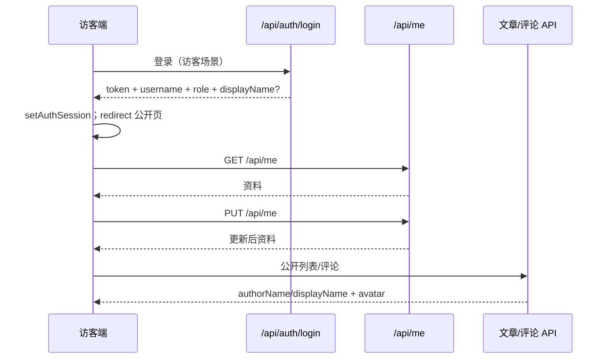
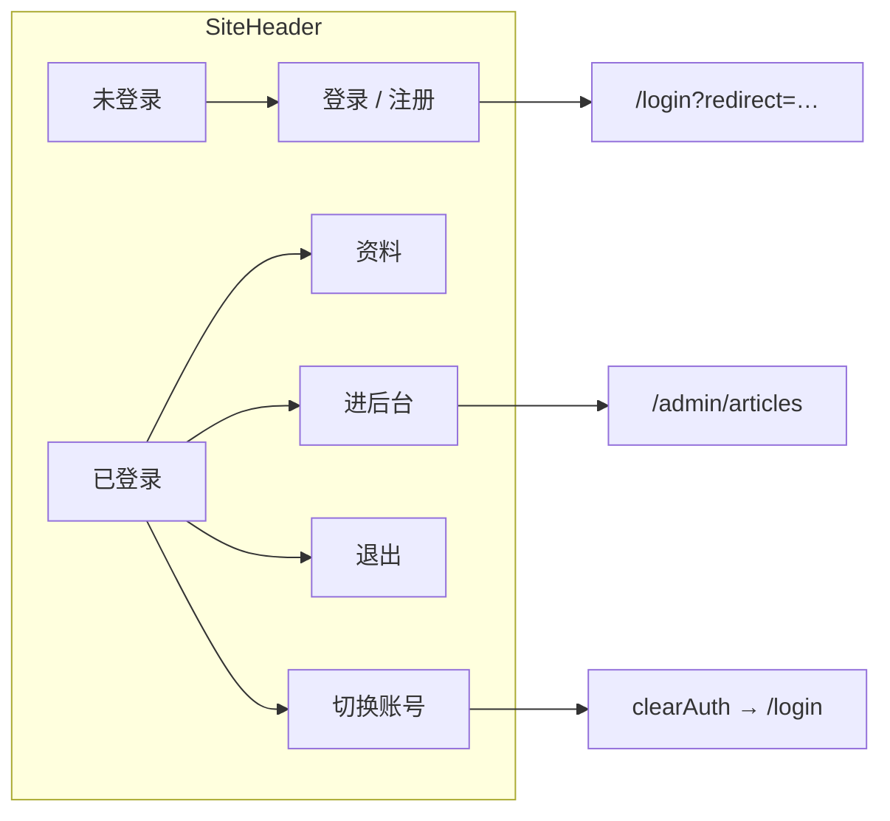

# Plan: 用户资料与访客端账号会话

> 基于：specs/blog-user-profile/spec.md v1.2（Implemented）  
> 状态：Implemented  
> 最后更新：2026-07-14

---

## 1. 方案概述

在既有 `users` / 注册登录上扩展**公开资料**，并补齐**访客端账号会话**体验：

- `users` 增加可空字段：`display_name`、`bio`、`avatar_url`
- 本人资料：`GET/PUT /api/me`（需登录）；不改登录名、不改密
- 文章 / 评论公开响应带上展示名与头像（展示名空则回退 `username`）
- 访客 Header：未登录 → 登录/注册；已登录 → 账号菜单（资料、进后台、登出、切换账号）
- `/login` 为访客场景登录（默认回公开区）；`/admin/login` 为管理场景（默认进后台）；共用登录组件，按路由区分 redirect
- 注册成功默认回访客首页（或 `redirect`），**不再**默认进后台
- 登出仅清前端会话（`clearAuth`）；服务端 Refresh 吊销留给 `blog-auth-refresh`

不新建 domain 包名；资料落在既有 `user` + 薄 `auth`/`me` 控制器。

---

## 2. 架构设计

### 2.1 模块划分

| 模块 | 职责 |
| --- | --- |
| `user.User` | 增加 `displayName` / `bio` / `avatarUrl` |
| `user.ProfileResponse` | 本人资料响应 DTO（无密码字段） |
| `user.ProfileUpdateRequest` | PUT Body；`@Size` 校验 |
| `user.ProfileService` | 读/更新当前用户；长度与空串归一；Service 层取当前用户 |
| `user.MeController`（或 `auth` 包） | `GET/PUT /api/me` |
| `auth.LoginResponse` | 可选附带 `displayName`、`avatarUrl`，便于登录后立刻刷新壳层 |
| `article.ArticleResponse` | `authorName` 解析为展示名回退；新增 `authorAvatarUrl` |
| `comment.CommentResponse` | 保留 `username`；新增 `displayName`、`avatarUrl` |
| `config.SecurityConfig` | `/api/me/**` → `authenticated()` |
| 前端 `api/profile.js` | `getMe` / `updateMe` |
| 前端 `utils/auth.js` | 会话可存 `displayName`、`avatarUrl`；登出仍 `clearAuth` |
| 前端 `LoginView` / 路由 | 按 `login` vs `admin-login` 区分默认落地与文案 |
| 前端 `SiteHeader` | 账号入口与菜单；站点头像与账号入口分离 |
| 前端 `ProfileView` | 公开布局下资料编辑页 |
| 前端 `RegisterView` / `ArticleDetailView` | 注册落地与评论登录 `redirect` |
| 验收 | `UserProfileTests` + `scripts/acceptance-user-profile.mjs` |

### 2.2 数据模型

```text
users
├── …既有 id / username / password_hash / role / created_at…
├── display_name     VARCHAR(32)  NULL
├── bio              VARCHAR(200) NULL
└── avatar_url       VARCHAR(512) NULL
```

| 决策 | 说明 |
| --- | --- |
| Schema | `ddl-auto: update`；旧行三字段为 `NULL` 即合法（展示回退 username、默认头像） |
| 字段名（Java / JSON） | `displayName`、`bio`、`avatarUrl`（列 `display_name`、`bio`、`avatar_url`） |
| 空串 | 更新时 trim；空串存 `NULL`（与「未设置」一致） |
| 登录名 | **不可**经 `/api/me` 修改 |
| 头像 | 仅存 URL 字符串；不校验可达性；本站图可填 `/uploads/...`（复用 media-upload） |

**长度上限（锁定）**

| 字段 | 上限 | 备注 |
| --- | --- | --- |
| `displayName` | 32 | 可空；非空时 trim 后长度 1–32 |
| `bio` | 200 | 可空 |
| `avatarUrl` | 512 | 可空；若非空须为合理 URL 形态（见 §2.4） |

### 2.3 接口定义

| 方法 | 路径 | 鉴权 | 说明 |
| --- | --- | --- | --- |
| GET | `/api/me` | 登录 | 当前用户资料 |
| PUT | `/api/me` | 登录 | 更新公开资料（整资源覆盖语义：请求体给出的字段更新；见下） |
| POST | `/api/auth/login` | 公开 | 既有；响应可增 `displayName`、`avatarUrl` |
| POST | `/api/auth/register` | 公开 | 既有；同上可选附带资料字段（新用户多为 null） |

**不**新增公开「按 userId 查资料」接口（本期评论/文章嵌套字段足够）。

**PUT Body（`ProfileUpdateRequest`）**

| 字段 | 类型 | 必填 | 说明 |
| --- | --- | --- | --- |
| `displayName` | string \| null | 否 | 省略则**保持原值**；显式 `null` 或 `""` → 清空为未设置 |
| `bio` | string \| null | 否 | 同上 |
| `avatarUrl` | string \| null | 否 | 同上 |

锁定：**部分更新**——仅对请求 JSON 中**出现的键**生效（可用 `Optional` 包装或 `JsonNullable`；若实现成本高，退化为「三字段均出现在 Body，客户端提交完整表单」——**本期锁定：资料编辑页提交完整三字段**，服务端每次用 Body 三值整体写入，简化实现）。

**成功 `data`（`ProfileResponse`）**

| 字段 | 类型 | 说明 |
| --- | --- | --- |
| `userId` | long | |
| `username` | string | 登录名，只读 |
| `role` | string | `ADMIN` / `AUTHOR` |
| `displayName` | string \| null | |
| `bio` | string \| null | |
| `avatarUrl` | string \| null | |

```json
{
  "code": 0,
  "message": "ok",
  "data": {
    "userId": 1,
    "username": "alice",
    "role": "AUTHOR",
    "displayName": "爱丽丝",
    "bio": "写点东西",
    "avatarUrl": "/uploads/2026/07/….png"
  }
}
```

**错误约定**

| 场景 | code | message 示例 |
| --- | --- | --- |
| 未登录 | 401 | 既有 |
| 字段超长 / 非法 URL | 400 | 「展示名不能超过 32 个字符」等 |
| 磁盘/其它 | 500 | 既有；不暴露内部细节 |

**文章公开字段（增量）**

| 字段 | 说明 |
| --- | --- |
| `authorName` | **解析后的展示名**：`displayName` 非空则用之，否则 `username`（兼容现有前端只读 `authorName`） |
| `authorAvatarUrl` | 新增；可 null |
| `authorId` | 既有 |

**评论公开字段（增量）**

| 字段 | 说明 |
| --- | --- |
| `username` | 既有登录名（不变） |
| `displayName` | 新增；可 null |
| `avatarUrl` | 新增；可 null |
| 前端展示名 | `displayName || username` |

### 2.4 校验规则（锁定）

`ProfileService.update`：

1. `CurrentUserService` 取当前用户；不存在 → 401  
2. `displayName`：trim；空 → null；否则长度 1–32，否则 400  
3. `bio`：trim；空 → null；否则 ≤ 200，否则 400  
4. `avatarUrl`：trim；空 → null；否则 ≤ 512，且须匹配：
   - 以 `http://` / `https://` 开头，或  
   - 以 `/` 开头的站点相对路径（如 `/uploads/...`）  
   - 拒绝含空白、`javascript:` 等（简单前缀白名单即可）  
5. 保存；返回 `ProfileResponse`（永不含 `passwordHash`）

### 2.5 Security

在 `SecurityConfig` 中、公开 `permitAll` 的 `/api/**` **之前**增加：

```text
.requestMatchers("/api/me", "/api/me/**").authenticated()
```

（与评论写接口同样写法。）

### 2.6 关键流程





### 2.7 前端（锁定）

| 位置 | 变更 |
| --- | --- |
| 路由 | 公开子路由增加 `profile`（如 `/profile`，`meta` 需登录可在 `beforeEach` 检查：未登录 → `/login?redirect=/profile`） |
| `/login` | 组件文案「账号登录」；`redirectTarget()`：合法公开路径优先；否则 `/`；**禁止**无 redirect 时进 `/admin` |
| `/admin/login` | 文案可保留「管理登录」或共用组件 `mode=admin`；默认 `/admin/articles`；仅接受以 `/admin` 开头的 redirect |
| 路由守卫 | 已登录访问 `login` / `admin-login`：按场景分别 `replace` 到公开默认或后台，**不要**访客登录页也一律踢去 `admin-articles`（改现有 `router.beforeEach`） |
| `RegisterView` | 成功后：若有公开 `redirect` 则去该处，否则 `home`；**去掉**「AUTHOR 默认进后台」 |
| `SiteHeader` | 右侧：保留站点品牌头像（链 `/about`）；旁增**账号区**——未登录链登录/注册；已登录展示用户头像或首字 + 下拉：我的资料 / 管理后台 / 退出 / 切换账号 |
| `ProfileView` | 表单：展示名、简介、头像 URL；可选「上传」调既有 `uploadMedia` 填 URL（ADMIN/AUTHOR 均可，与现网角色一致）；保存调 `PUT /api/me`；成功后刷新 `setAuthSession` 展示字段 |
| `ArticleDetailView` | 「登录」链：`/login?redirect=` + 当前 `fullPath`；评论作者展示 `displayName \|\| username` + 小头像 |
| `auth.js` / `utils/auth` | `setAuthSession` 可带 `displayName`、`avatarUrl`；登出 `clearAuth` |
| 管理布局 | 既有「回访客站 / 退出」保留；可选链到 `/profile`（非必须） |

**redirect 合法性（前端）**

- 公开：以 `/` 开头、**不以** `/admin` 开头、不含 `://`（防开环）
- 管理：以 `/admin` 开头且不是登录页本身

### 2.8 验收手段

1. **后端测试**：`UserProfileTests`  
   - 登录后 GET/PUT `/api/me` 成功；响应无 `password`/`passwordHash`  
   - 超长 displayName/bio/avatarUrl → 400  
   - 未登录 GET/PUT → 401  
   - 更新 displayName 后，公开文章 `authorName` 与评论 `displayName` 可见  
2. **脚本**：`scripts/acceptance-user-profile.mjs`  
   - 注册或登录 → PUT 资料 → GET me → 发评论或查文章断言展示字段  
3. **手工**（Plan 走查，对应 AC-7～13）：Header 入口、登录回跳、进后台、登出、切换账号、站点头像与账号入口不混淆

---

## 3. 技术选型

| 决策点 | 选型 | 理由 |
| --- | --- | --- |
| 资料路径 | `/api/me` | 短、语义清晰；非 admin 区 |
| 更新语义 | 资料页提交完整三字段 | 实现简单，够用 |
| 文章作者名 | 复用 `authorName` 为解析后展示名 | 少改现有访客 UI |
| 评论 | 保留 `username` + 新增 `displayName`/`avatarUrl` | 不破坏既有字段语义 |
| 登出 | 仅前端 `clearAuth` | Spec Non-Goals；对齐 auth-refresh 边界 |
| 头像上传 | 复用 `/api/admin/media` | 已 Implemented；无专用头像 API |
| 登录页 | 单组件双模式（route name） | 少重复；redirect 规则分叉 |

---

## 4. 风险与备选方案

| 风险 | 缓解 |
| --- | --- |
| 改 `authorName` 语义后旧缓存/脚本仍期望登录名 | 验收与文档写明；需要登录名时用既有 `authorId` 或后续再加 `authorUsername`（本期不加除非测试需要） |
| 路由守卫仍把 `/login` 踢去后台 | Task 明确改 `beforeEach`；加手工/脚本覆盖 |
| 注册默认进后台打断读者 | Task 改 `RegisterView` 落地规则 |
| 外链头像 XSS | URL 仅作 `img src`；白名单 http(s)/相对路径；MD 消毒不涉及 |
| 局部更新 JSON 省略字段误清空 | 锁定「完整三字段提交」 |

**备选（不采用）**：独立 `GET /api/users/{id}` 公开主页——超出本期 AC。

---

## 5. 与 Constitution 的对齐检查

- [x] 不引入 ES / Redis / MQ / OSS SDK / SSR
- [x] 统一 `{ code, message, data }`；权限在 Service + Security
- [x] 密码与 Token 不进日志；响应无 passwordHash
- [x] domain 落在既有 `user` / `auth` / `article` / `comment`
- [x] 关键路径可自动化验收；前端会话用手工清单补充
- [x] PR / 提交说明引用 `blog-user-profile` 与 Task 编号

---

## 6. 变更记录

| 版本 | 日期 | 变更说明 |
| --- | --- | --- |
| v1.0 | 2026-07-14 | 初稿 Approved；锁定 `/api/me`、三字段与长度、文章/评论展示字段、访客/管理双登录场景与 Header 会话菜单 |
| v1.1 | 2026-07-14 | Implemented；`UserProfileTests` 通过 |
