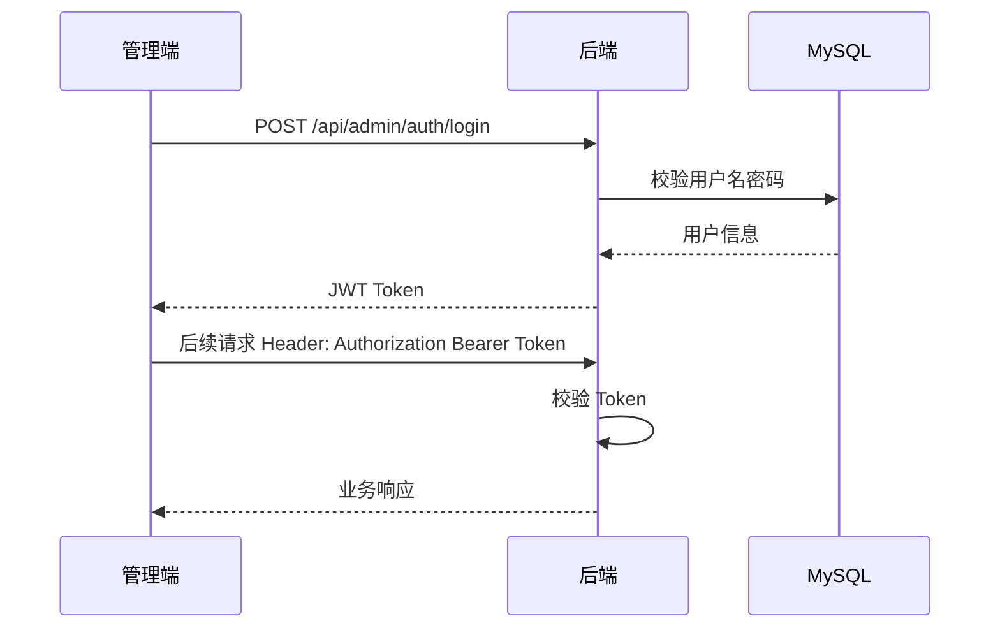
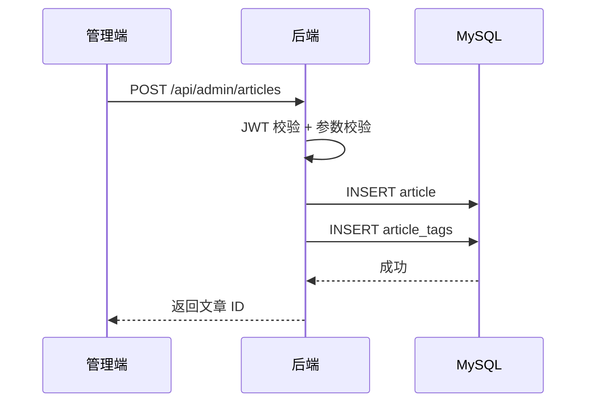
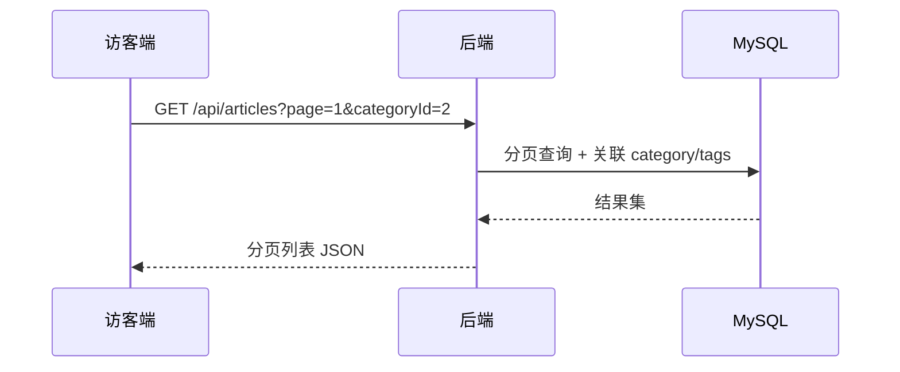

# Plan: 个人博客（基础版 MVP）

> 基于：specs/personal-blog/spec.md v1.0  
> 状态：Approved  
> 最后更新：2026-07-13

---

## 1. 方案概述

采用**前后端分离 + 单体后端**架构：Spring Boot 提供 REST API，Vue 3
单应用承载访客阅读页与管理后台（路由分区）。MySQL 持久化文章、分类、
标签数据；管理端通过 JWT 鉴权保护写操作。访客端只读公开接口，列表支持
分页、分类/标签筛选与标题关键词搜索。

访客端视觉遵循**简洁、卡通、年轻化、治愈系**（Notion 插画气质）；
管理端功能优先，采用简洁后台样式，不强行套用卡通插画。

---

## 2. 架构设计

### 2.1 模块划分

| 模块 | 职责 | 对应 Spec |
| --- | --- | --- |
| **auth** | 管理员登录、JWT 签发与校验 | AC-6、AC-10 |
| **article** | 文章 CRUD、列表、详情、搜索 | AC-1～AC-5、AC-7 |
| **category** | 分类 CRUD、按分类筛选 | AC-3、AC-8 |
| **tag** | 标签 CRUD、按标签筛选 | AC-3、AC-9 |
| **common** | 统一响应、异常处理、参数校验 | AC-11～AC-13 |

**后端包结构（建议）：**

```text
com.example.blog
├── config/          Security、CORS、JWT 配置
├── common/          Result、异常、全局处理器
├── auth/            登录接口
├── article/         文章领域
├── category/        分类领域
└── tag/             标签领域
```

**前端路由（建议）：**

```text
/                    首页（Hero + 最新文章单列卡片）
/articles            文章列表（筛选/搜索）
/articles/:id        文章详情
/about               关于我（静态页）
/admin/login         管理登录
/admin/articles      文章管理
/admin/categories    分类管理
/admin/tags          标签管理
```

> 简化说明：分类/标签不再做独立路由页，统一在 `/articles`
> 以筛选参数（`categoryId` / `tagId` / `keyword`）呈现，减少页面类型。

### 2.2 数据模型

```text
users
├── id            BIGINT PK
├── username      VARCHAR(64) UNIQUE
├── password_hash VARCHAR(255)
└── created_at    DATETIME

categories
├── id            BIGINT PK
├── name          VARCHAR(64) UNIQUE
└── created_at    DATETIME

tags
├── id            BIGINT PK
├── name          VARCHAR(64) UNIQUE
└── created_at    DATETIME

articles
├── id            BIGINT PK
├── title         VARCHAR(200)
├── content       TEXT
├── category_id   BIGINT FK → categories.id
├── published_at  DATETIME
├── created_at    DATETIME
└── updated_at    DATETIME

article_tags
├── article_id    BIGINT FK → articles.id
└── tag_id        BIGINT FK → tags.id
    PRIMARY KEY (article_id, tag_id)
```

**关系说明：**

- `Article` N:1 `Category`（一篇文章一个分类）
- `Article` N:M `Tag`（通过 `article_tags` 关联）
- `User` 1:N `Article`（MVP 仅一个管理员，可不存 author_id）

**索引建议：**

- `articles(published_at DESC)` — 列表排序
- `articles(category_id)` — 分类筛选
- `articles(title)` — 标题搜索（LIKE）
- `article_tags(tag_id)` — 标签筛选

### 2.3 接口定义

**统一响应结构：**

```json
{
  "code": 0,
  "message": "ok",
  "data": {}
}
```

| 方法 | 路径 | 说明 | 请求/响应要点 |
| --- | --- | --- | --- |
| **公开接口（无需登录）** | | | |
| GET | `/api/articles` | 文章列表 | Query 分页/筛选/keyword |
| GET | `/api/articles/{id}` | 文章详情 | 含标题、正文、时间、分类、标签 |
| GET | `/api/categories` | 分类列表 | 返回 id、name |
| GET | `/api/tags` | 标签列表 | 返回 id、name |
| **管理接口（需 JWT）** | | | |
| POST | `/api/admin/auth/login` | 管理员登录 | Body: username、password；返回 token |
| GET | `/api/admin/articles` | 管理端文章列表 | 支持分页，含全部字段 |
| POST | `/api/admin/articles` | 创建文章 | Body: 标题/正文/分类/标签/时间 |
| GET | `/api/admin/articles/{id}` | 管理端文章详情 | |
| PUT | `/api/admin/articles/{id}` | 更新文章 | |
| DELETE | `/api/admin/articles/{id}` | 删除文章 | 级联删除 article_tags |
| GET | `/api/admin/categories` | 分类列表 | |
| POST | `/api/admin/categories` | 创建分类 | Body: name |
| PUT | `/api/admin/categories/{id}` | 更新分类 | |
| DELETE | `/api/admin/categories/{id}` | 删除分类 | 有文章引用时返回业务错误 |
| GET | `/api/admin/tags` | 标签列表 | |
| POST | `/api/admin/tags` | 创建标签 | |
| PUT | `/api/admin/tags/{id}` | 更新标签 | |
| DELETE | `/api/admin/tags/{id}` | 删除标签 | 级联删除 article_tags |

**错误码约定（建议）：**

| code | 含义 |
| --- | --- |
| 0 | 成功 |
| 400 | 参数校验失败 |
| 401 | 未登录或 Token 无效 |
| 404 | 资源不存在 |
| 409 | 业务冲突（如分类被引用无法删除） |
| 500 | 服务器内部错误 |

### 2.4 关键流程

**管理员登录：**



**文章发布（创建）：**



**访客浏览列表：**



### 2.5 访客端 UI / 视觉规范

整体气质：**简洁、卡通、年轻化、治愈系**，参考 Notion 官网插画风格。
留白充足，避免拥挤。管理端不强制本规范，见下文「冲突简化」。

#### 配色（CSS 变量）

| 用途 | 色值 | 说明 |
| --- | --- | --- |
| 背景 | `#FFFFFF` | 页面底色 |
| 主色 | `#6FCF97` | 薄荷绿：主按钮、选中态 |
| 辅助 A | `#FF8A65` | 暖桃橘：次要强调、标签 |
| 辅助 B | `#B388FF` | 薰衣草紫：装饰、次按钮 |
| 文字 | `#2D3436` | 正文与标题 |
| 强调 | `#FFD93D` | 高亮、星星等点缀 |

```css
:root {
  --bg: #FFFFFF;
  --primary: #6FCF97;
  --accent-peach: #FF8A65;
  --accent-lilac: #B388FF;
  --text: #2D3436;
  --highlight: #FFD93D;
  --radius-lg: 20px;
  --radius-pill: 999px;
}
```

#### 字体

| 用途 | 字体 | 加载方式 |
| --- | --- | --- |
| 标题 / Logo | Quicksand | Google Fonts |
| 正文 | Inter | Google Fonts |
| Logo「手写感」 | Quicksand 加粗 + 轻微字距 | 不另引书法字体，降低依赖 |

#### 布局结构

```text
┌──────────────────────────────────────────────┐
│ Logo(手写感)   [首页][文章][关于我]   (头像)  │  顶栏
├──────────────────────────────────────────────┤
│  欢迎语（左）          卡通插画（右）          │  Hero（仅首页）
├──────────────────────────────────────────────┤
│  [──────── 单列卡片 ────────]                │  按时间倒序
│  [──────── 单列卡片 ────────]                │
│  [──────── 单列卡片 ────────]                │
├──────────────────────────────────────────────┤
│  手写体标语 · 社交图标                         │  页脚
└──────────────────────────────────────────────┘
```

1. **顶栏**
   - 左：站点 Logo（Quicksand，手写感）
   - 中/右：3 个**胶囊按钮**（首页 / 文章 / 关于我）
   - 最右：圆形卡通头像（点击进「关于我」；MVP 用静态图）
2. **Hero（仅首页）**
   - 居中双栏：左欢迎语
     `Hi, 我是XXX 👋 欢迎来到我的小宇宙`
   - 右：卡通插画角色（静态 SVG/PNG，不上插画库）
3. **文章列表**
   - **单列**纵向卡片（按发布时间倒序，与时间线阅读一致）
   - 圆角 `20px`；浅阴影；单卡可展示更长摘要
   - 卡片左侧或左上角小卡通 emoji（可按分类映射，无则默认）
4. **页脚**
   - 一句手写感标语 + 社交图标（外链即可；无账号可隐藏）

#### 内容宽度

| 区域 | 建议 max-width | 相对原 1080/760 方案 |
| --- | --- | --- |
| 站点内容区（列表等） | `1360px` | 约 1.26×（原 1080） |
| 文章详情正文区 | `1040px` | 约 1.37×（原 760） |
| 关于页主卡片 | `800px` | 约 1.25×（原 640） |

> 取值落在 1.25～1.5 倍区间，列表略宽便于单列摘要，
> 详情略收以保持长文可读；窄屏仍 `100%` 自适应。

#### 细节

- 按钮、卡片统一大圆角（卡片 20px，按钮胶囊形）
- 背景零星散布低透明度 SVG 小星星、波浪线（纯装饰，不影响可读性）
- 留白充足：区块间距建议 ≥ 48px，单列卡片间距 ≥ 20px

#### 页面与组件映射

| 页面 | 组成 |
| --- | --- |
| 首页 `/` | 顶栏 + Hero + 最新文章单列卡片 + 页脚 |
| 文章 `/articles` | 顶栏 + 筛选/搜索条 + 单列卡片 + 分页 + 页脚 |
| 详情 `/articles/:id` | 顶栏 + 加宽大圆角内容区 + 页脚 |
| 关于 `/about` | 顶栏 + 头像/简介卡片 + 页脚 |

#### 冲突简化（已拍板）

| 原方案 / 难点 | 简化决策 |
| --- | --- |
| Element Plus 与治愈系冲突 | **仅管理端**用 Element Plus；访客端自写 CSS |
| Notion 级插画难自绘 | MVP 用 1～2 张静态 SVG/PNG 或开源插画 |
| 侧栏分类 + 列表拥挤 | 去掉访客侧栏；分类/标签改为列表顶筛选 |
| 2 列卡片 vs 时间倒序 | 改为单列卡片，时间线更顺、摘要更长 |
| 独立分类/标签/搜索页过多 | 合并进 `/articles` 查询参数 |
| 「关于我」无后端字段 | MVP 静态文案写在前端配置，不新增接口 |
| 手写字体版权/加载 | 用 Quicksand 模拟，不引入额外书法字体 |
| 管理端套卡通成本高 | 管理端保持简洁后台，仅主色点缀薄荷绿 |

---

## 3. 技术选型

| 决策点 | 选型 | 理由 |
| --- | --- | --- |
| 后端框架 | Spring Boot 3.x | Spec 建议栈，生态成熟 |
| ORM | Spring Data JPA | 快速开发，关系映射简单 |
| 数据库 | MySQL 8.x | 关系型数据，满足多表关联 |
| 认证 | Spring Security + JWT | 无状态，适合前后端分离 |
| 密码存储 | BCrypt | 行业标准哈希 |
| 前端框架 | Vue 3 + Vite | Spec 建议栈，上手快 |
| 访客端 UI | 自写 CSS + CSS 变量 | 落实治愈系视觉，避免组件库打架 |
| 管理端 UI | Element Plus | 表格/表单效率优先 |
| 字体 | Quicksand + Inter | Google Fonts，标题/正文分工 |
| HTTP 客户端 | Axios | 拦截器统一处理 Token 与错误 |
| 标题搜索 | MySQL `LIKE %keyword%` | MVP 数据量小，满足 AC-4 |
| 部署（本地） | 后端 8080 + 前端 dev proxy | 开发期 Vite 代理 `/api` |

---

## 4. 风险与备选方案

| 风险 | 影响 | 缓解措施 |
| --- | --- | --- |
| JWT 无法主动失效 | 登出后 Token 仍可用至过期 | MVP 设较短过期时间（如 2h） |
| 标题 LIKE 搜索性能差 | 文章量大时变慢 | MVP 可接受；进阶换 ES |
| 分类删除引用检查遗漏 | 数据不一致 | Service 层强制校验 + 测试 |
| 前后端跨域 | 开发环境请求失败 | 配置 CORS + Vite proxy |
| 正文 XSS | 恶意脚本注入 | 前端展示时转义；进阶用 sanitizer |
| 插画资源缺失 | Hero 右侧空白 | 先用 emoji/SVG 占位，再替换 |
| Google Fonts 加载慢 | 首屏 FOIT | `font-display: swap`；可本地托管 |

---

## 5. 与 Spec 的对齐检查

- [x] 前后端分离，REST API + JSON（AC-11）
- [x] 统一响应 `code / message / data`（AC-12）
- [x] 管理接口 JWT 保护（AC-10）
- [x] 列表分页默认 10 条（AC-1）
- [x] 分类/标签筛选与标题搜索（AC-3、AC-4）
- [x] 分类删除引用校验（AC-8）
- [x] 全局异常处理，不暴露堆栈（AC-13）
- [x] 未纳入 Non-Goals 范围的功能（评论、ES、Redis 等）
- [x] 访客端具备阅读入口；管理端独立（Constraints）
- [x] UI 规范不改变 Spec 功能边界，仅约束 HOW

> 项目级 `constitution.md` 尚未创建；正式开发前建议补充并复核本节。

---

## 6. 变更记录

| 版本 | 日期 | 变更说明 |
| --- | --- | --- |
| v1.0 | 2026-07-13 | 基于 spec v1.0 初稿 |
| v1.1 | 2026-07-13 | 增补访客端 UI 规范；简化路由与组件库分工 |
| v1.2 | 2026-07-13 | 文章列表改单列；内容区加宽约 1.25～1.4× |
| v1.2 | 2026-07-13 | 状态变更为 Approved |
